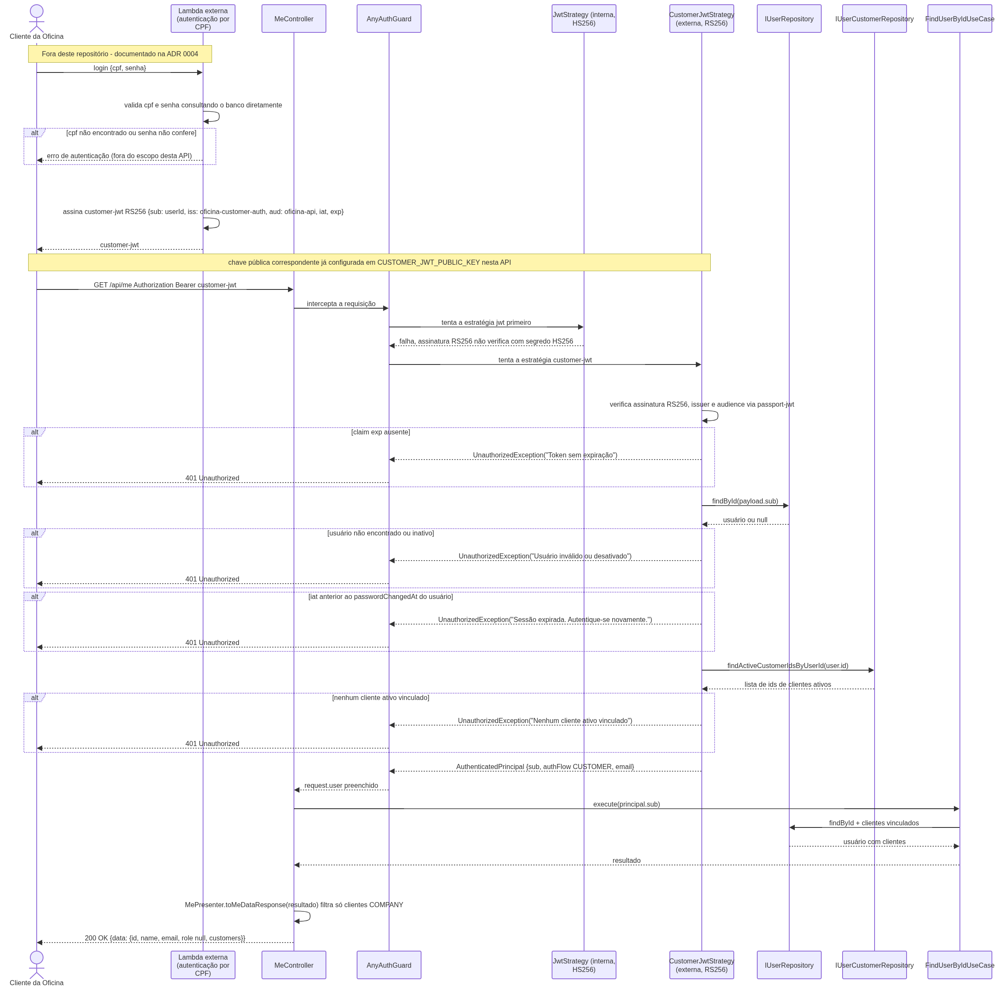
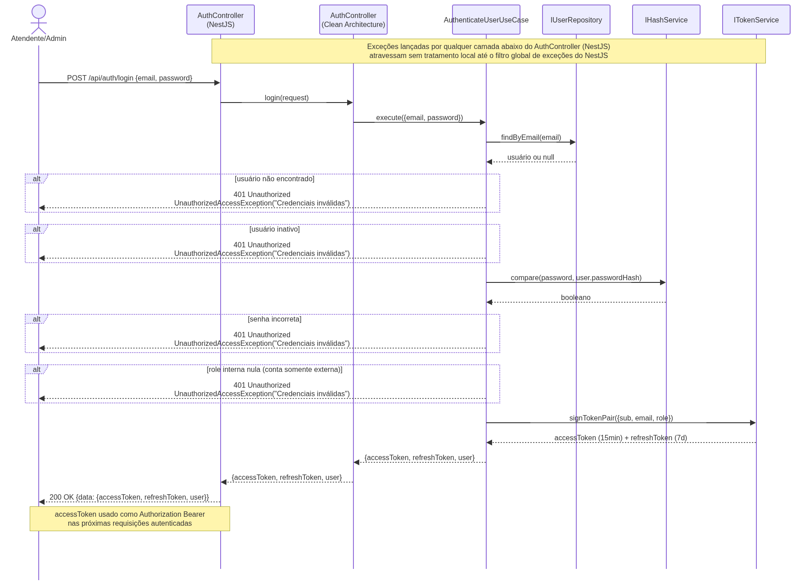
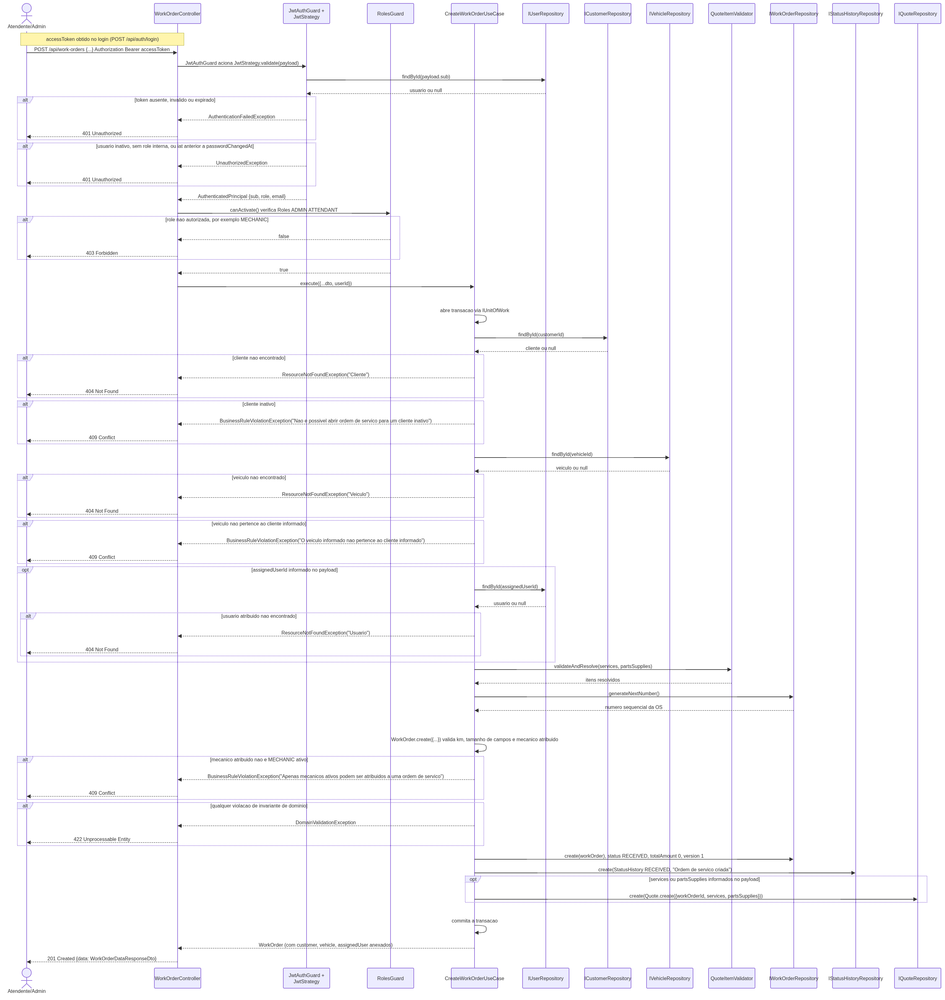

# 🏛️ Arquitetura

Clean Architecture + DDD do backend da Oficina Mecânica — camadas estritas, entidades ricas e agregados protegendo invariantes.

## Índice

- [Estrutura de camadas](#estrutura-de-camadas)
- [Modelos do banco de dados](#modelos-do-banco-de-dados)
- [DDD — Aggregate Roots, Entidades e Value Objects](#ddd--aggregate-roots-entidades-e-value-objects)
- [Concorrência otimista](#concorrência-otimista)
- [Perfis de usuário (RBAC)](#perfis-de-usuário-rbac)
- [Identidade externa, autenticação e autorização por vínculo](#identidade-externa-autenticação-e-autorização-por-vínculo)
- [Unit of Work](#unit-of-work)
- [Ciclo de vida da Ordem de Serviço](#ciclo-de-vida-da-ordem-de-serviço)
- [Ciclo de vida do Orçamento](#ciclo-de-vida-do-orçamento)
- [Estoque, reservas e movimentações](#estoque-reservas-e-movimentações)
- [Aprovação de orçamento por e-mail](#aprovação-de-orçamento-por-e-mail)
- [Exceções por Camada](#exceções-por-camada)
- [Logs estruturados](#logs-estruturados)
- [Telemetria: traces e métricas](#telemetria-traces-e-métricas)
- [Decisões de Arquitetura (ADRs)](#decisões-de-arquitetura-adrs)
- [Modelo C4](#modelo-c4)

## Estrutura de camadas

O projeto segue **Clean Architecture** com separação estrita de camadas e adota práticas de **Domain-Driven Design** — entidades ricas, value objects, agregados (Aggregate Roots), invariantes de domínio e regras de negócio encapsuladas no próprio domínio. O código-fonte aponta apenas para dentro: `domain/` e `application/` são **livres de framework e ORM** (uma cerca de ESLint proíbe `@nestjs/*`, `@generated/client` e `@opentelemetry/*` nessas camadas — e em `interface-adapters/` — quebrando a build se violada). A camada `interface-adapters/` concentra os **Clean Controllers** e **Presenters** (POJOs livres de framework); a borda NestJS (rotas, Swagger, guards, DTOs) fica em `infrastructure/http/` e apenas **delega** ao Clean Controller.

Toda a aplicação fica sob o diretório `app/` na raiz do repositório (código, testes, Prisma e todas as configs de tooling); a raiz guarda apenas concerns transversais (`README.md`, `.gitignore`) e as pastas `docs/`, `infra/`, `k8s/`, `collections/`, `reports/` e `openspec/`.

```
app/src/
├── domain/                          # Camada de domínio (regras de negócio puras, sem framework)
│   ├── entities/                    # Entidades ricas com validação de domínio e invariantes
│   │                                # WorkOrder e Quote são Aggregate Roots
│   ├── value-objects/               # Document (CPF/CNPJ), Email, Phone, Plate,
│   │                                # ZipCode, Address, LineItemPrice, WorkOrderNumber
│   ├── enums/                       # UserRole, CustomerType, WorkOrderStatus,
│   │                                # WorkOrderServiceStatus, QuoteStatus,
│   │                                # QuoteDecisionAction, StockMovementType, Unit,
│   │                                # PartSupplyCategory, SortDirection
│   ├── exceptions/                  # DomainException, DomainValidationException,
│   │                                # EntityNotFoundException, BusinessRuleViolationException
│   ├── constants/                   # Regex compartilhadas (placa, telefone, e-mail, senha)
│   │                                # + limites de validação por agregado
│   ├── validators/                  # DocumentValidator (CPF/CNPJ com dígito verificador)
│   └── interfaces/                  # Contratos da camada de domínio (permanecem no domínio)
│       ├── common/                  # PaginationQuery, PaginatedResult, SortCriterion
│       └── repositories/            # Contratos de repositórios (IRepository) + IUnitOfWork
│
├── application/                     # Camada de aplicação (orquestração de casos de uso, sem framework)
│   ├── ports/
│   │   ├── input/<domínio>/         # I<Nome>UseCase (input ports) + DTOs de entrada
│   │   └── output/                  # IEmailSenderService, IHashService, ITokenService,
│   │                                # ILogger (output ports)
│   ├── metrics/                     # IMetrics é a porta; aqui ficam o catálogo tipado das
│   │                                # métricas de negócio e o cálculo puro de permanência
│   │                                # por status e dos dois totais
│   ├── logging/                     # LogEventDefinition + catálogo tipado e fechado
│   │                                # de eventos de NEGÓCIO (nomes lógicos, sem chave física)
│   ├── policies/                    # CustomerAccessPolicy — autorização por vínculo,
│   │                                # reutilizável por qualquer caso de uso de /api/me/*
│   ├── use-cases/
│   │   ├── auth/                    # Authenticate, RefreshToken, IssuePasswordResetCode,
│   │   │                            # ConfirmPasswordReset
│   │   ├── user/                    # CRUD + atualização de status
│   │   ├── customer/                # CRUD completo de clientes (createAccess opcional)
│   │   ├── customer-access/         # GrantCustomerAccess, ListCustomerAccessUsers,
│   │   │                            # ListUserCustomers, RevokeCustomerAccess,
│   │   │                            # UpdateCustomerStatus
│   │   ├── me/                      # ChangeOwnPassword, FindAllMyWorkOrders,
│   │   │                            # FindMyWorkOrderById, FindMyWorkOrdersQuotes,
│   │   │                            # FindMyQuoteById, DecideMyQuote — usuário externo
│   │   │                            # autenticado (identidade via FindUserByIdUseCase,
│   │   │                            # reaproveitado de user/)
│   │   ├── vehicle/                 # CRUD + busca por cliente
│   │   ├── service/                 # CRUD + métricas (individual e agregada paginada)
│   │   ├── part-supply/             # CRUD + movimentação de estoque
│   │   ├── stock/                   # Consulta de movimentações e reservas
│   │   ├── work-order/              # Criação, busca, atualização, status,
│   │   │                            # status de serviços, histórico
│   │   └── quote/                   # CRUD, itens, envio por e-mail, aprovação/rejeição
│   │                                # (Approve/Reject/EmailDecision/UpdateStatus)
│   ├── exceptions/                  # ResourceNotFoundException, ResourceConflictException,
│   │                                # UnauthorizedAccessException
│   └── utils/                       # PaginationUtil (sanitização e cálculo de páginas)
│
├── interface-adapters/<domínio>/    # Adapters livres de framework (POJOs, zero @nestjs/*)
│                                    # domínios: auth, customer, customer-access, me,
│                                    # part-supply, quote, service, stock, user, vehicle,
│                                    # work-order
│   ├── <domínio>.controller.ts      # Clean Controller: orquestra o(s) use-case(s) + Presenter
│   ├── <domínio>.presenter.ts       # Entidade → tipo de resposta PURO (sem @ApiProperty)
│   ├── requests/                    # Tipos de request do controller (defaults de paginação aqui)
│   └── responses/                   # <Dom>Response / <Dom>DataResponse / <Dom>PaginatedResponse
│
├── infrastructure/                  # Implementações concretas (framework e serviços externos)
│   ├── config/                      # app-bootstrap (composição da borda HTTP, compartilhada
│   │                                #   entre main.ts e o helper de E2E) + swagger.config
│   ├── health/                      # Saúde operacional, agnóstica de transporte:
│   │   │                            # health.constants (módulo folha: segmentos de rota e o
│   │   │                            #   conjunto fechado de caminhos),
│   │   │                            # postgres.health-check (SELECT 1 com query_timeout
│   │   │                            #   próprio + prazo do chamador; categoria fechada),
│   │   │                            # readiness-state (ready|draining, single-flight, transição)
│   ├── http/                        # Borda NestJS — @Controller fino que delega ao Clean Controller
│   │   ├── http.constants.ts        # Prefixo global (`api`) — módulo folha lido por
│   │   │                            #   config/app-bootstrap e por health/health.constants
│   │   ├── controllers/<domínio>/   # @Controller + module + dto/requests + dto/responses
│   │   │                            # (@ApiProperty; *ResponseDto implements o tipo puro)
│   │   │                            # domínios no singular; auth em controllers/auth/;
│   │   │                            # customer-access/ tem dois controllers
│   │   │                            # (CustomerAccessController, UserCustomersController);
│   │   │                            # me/ expõe as rotas do usuário externo; e as rotas
│   │   │                            # de saúde em controllers/health/
│   │   ├── guards/                  # JwtAuthGuard, RolesGuard, CustomerJwtAuthGuard,
│   │   │                            # AnyAuthGuard (aceita interno OU externo)
│   │   ├── decorators/              # @CurrentUser, @Roles, @Public
│   │   ├── strategies/              # JwtStrategy (HS256, interno),
│   │   │                            # CustomerJwtStrategy (RS256, externo) — Passport,
│   │   │                            # nunca um verificador compartilhado
│   │   ├── filters/                 # Exception Filters: Domain, Application,
│   │   │                            # Infrastructure, AllExceptions
│   │   ├── interceptors/            # DateSerializerInterceptor (ISO 8601 com timezone),
│   │   │                            # RequestContextInterceptor (handler → contexto de log)
│   │   ├── pipes/                   # SanitizeStringsPipe (global, antes do ValidationPipe)
│   │   ├── validators/              # IsValidCpfCnpj (adapter class-validator)
│   │   └── common/dto/              # PaginationDto, PaginatedResponseDto compartilhados
│   ├── persistence/prisma/          # PrismaService + PrismaModule (singleton de conexão)
│   │   ├── repositories/            # Implementações Prisma (10 repositórios) + PrismaUnitOfWork +
│   │   │                            # RepositoriesModule (@Global) — única pasta a importar @generated/client
│   │   ├── mappers/                 # Conversão Prisma model → Entidade de domínio (14 mappers)
│   │   └── helpers/                 # Helpers de paginação, existência e ordenação (Prisma)
│   ├── logging/                     # LoggingModule (@Global) + PinoLoggerAdapter,
│   │   │                            # logger.config (config + trust proxy),
│   │   │                            # field-registry (campos lógicos → chaves físicas +
│   │   │                            #   dicionário derivado),
│   │   │                            # technical-event.catalog, access-log.builder
│   │   │                            #   (atributos HTTP + desfecho + resolvedor de nível),
│   │   │                            # url-attributes (sanitizeUrlPath + buildQueryString),
│   │   │                            # http-error-message (404 do framework + detalhe de validação),
│   │   │                            # request-log-context, error-serializer,
│   │   │                            # log-record-normalizer, logging-diagnostics,
│   │   │                            # http-failure.recorder, process-lifecycle.service
│   │   └── redaction/               # field-classifier (tokenizador + regras),
│   │                                # pii-masker, text-sanitizer,
│   │                                # payload-sanitizer (valores E nomes de propriedade)
│   ├── telemetry/                   # TelemetryModule (@Global) + OtelMetricsAdapter,
│   │                                # metric-registry (lógico → físico + agregação),
│   │                                # span-request-attributes (sobrescreve url.path,
│   │                                #   client.address e user_agent.original; remove url.query),
│   │                                # incoming-request-filter (exclusão das probes),
│   │                                # telemetry-lifecycle.service (flush no encerramento),
│   │                                # telemetry-resource, telemetry-diagnostics
│   ├── services/                    # BcryptHashService, JwtTokenService,
│   │                                # MailerEmailSenderService + InfrastructureServicesModule
│   └── exceptions/                  # InfrastructureException, AuthenticationFailedException,
│                                    # DatabaseOperationException, ServiceIntegrationException,
│                                    # ConcurrencyException
│
├── app.module.ts
├── otel.ts                          # preload (`node --require`): registra as instrumentações
│                                    # ANTES de express/pg serem carregados; sem endpoint,
│                                    # não registra nada
└── main.ts                          # bufferLogs + useLogger, configureApp(), shutdown hooks, listen

app/test/
├── helpers/                         # Mock factories reutilizáveis (incluindo
│                                    # UnitOfWorkMockFactory) e helpers de E2E
│                                    # (auth, db cleanup, test app bootstrap)
├── unit/                            # 191 suites de testes unitários (espelham src/)
│   ├── domain/                      # entities/, value-objects/, validators/
│   ├── application/use-cases/       # auth, customer, customer-access, me,
│   │                                # part-supply, quote, service, stock, user,
│   │                                # vehicle, work-order
│   ├── interface-adapters/          # Clean Controllers + Presenters por domínio
│   └── infrastructure/              # http/ (controllers, filters, interceptors, pipes,
│                                    # validators, auth), persistence/prisma, services
└── e2e/                             # 12 suites de testes E2E (Testcontainers + PostgreSQL real)
    ├── all-exceptions.filter.e2e-spec.ts
    ├── auth.e2e-spec.ts
    ├── customer.e2e-spec.ts
    ├── logging.e2e-spec.ts
    ├── me.e2e-spec.ts                 # /api/me/*: identidade externa, senha, OS e
    │                                  # orçamentos vinculados, decisão de orçamento
    ├── part-supply.e2e-spec.ts
    ├── quote.e2e-spec.ts
    ├── service.e2e-spec.ts
    ├── stock.e2e-spec.ts
    ├── telemetry.e2e-spec.ts
    ├── user.e2e-spec.ts
    ├── vehicle.e2e-spec.ts
    └── work-order.e2e-spec.ts

app/prisma/
├── schema.prisma                    # Schema do banco (16 modelos, 8 enums)
├── prisma.config.ts                 # Configuração do Prisma v7 (adapter-pg)
├── migrations/                      # Migrations geradas pelo Prisma — inclui a sequence
│                                    # `work_order_number_seq` (números de OS),
│                                    # endurecimento de cascade deletes,
│                                    # versionamento (colunas `version`) e índices
├── generated/                       # Prisma Client gerado (output local)
├── seed.ts                          # Entry point do seed
└── seeds/                           # Scripts de seed por entidade (work-order-status-info,
                                     # user, customer, vehicle, service, part-supply, work-order)
```

## Modelos do banco de dados

18 modelos: `User`, `Customer`, `Address`, `Vehicle`, `Service`, `PartSupply`, `WorkOrderStatusInfo`, `WorkOrder`, `WorkOrderService`, `WorkOrderPartSupply`, `Quote`, `QuoteService`, `QuotePartSupply`, `StatusHistory`, `StockMovement`, `StockReservation`, `UserCustomer`, `PasswordResetCode`. `WorkOrderStatusInfo` (`work_order_statuses`) é uma **tabela de referência** (lookup) — não expõe API própria e é populada pelo seed. `UserCustomer` (`user_customers`) é o vínculo many-to-many entre `User` e `Customer` que autoriza o acesso externo (chave primária composta `(userId, customerId)`, sem `accessType` — a semântica vem de `Customer.type`); `PasswordResetCode` (`password_reset_codes`) guarda o código de redefinição de senha em vigor por usuário (`userId` como chave primária — no máximo um código ativo por vez).

Enums refletidos no banco: `UserRole`, `CustomerType`, `WorkOrderStatus`, `WorkOrderServiceStatus`, `QuoteStatus`, `StockMovementType`, `Unit`, `PartSupplyCategory`. `UserRole` **não** ganhou um valor `CUSTOMER` — o acesso externo não é modelado como papel interno (ver [ADR 0004](./adr/0004-autenticacao-de-clientes.md)).

Convenções de modelagem:

- **IDs**: `uuid` v4 (`@db.Uuid`) gerados pelo Prisma — exceto o número da OS, gerado por uma **sequence PostgreSQL** (`work_order_number_seq`, formatada com 6 dígitos zero-padded — `000001`, `000002`, …).
- **Timestamps**: `created_at` / `updated_at` em todas as entidades não-imutáveis (Address, StatusHistory, StockMovement e StockReservation guardam apenas `created_at`).
- **Concorrência otimista**: coluna `version Int @default(1)` em `WorkOrder`, `Quote` e `PartSupply`.
- **Cascade deletes** para itens dependentes (`WorkOrderService`, `WorkOrderPartSupply`, `QuoteService`, `QuotePartSupply`, `StatusHistory`, `StockReservation`, `Address`).
- **`StockMovement.workOrderId`** usa `onDelete: SetNull` para preservar histórico de movimentação após exclusão da OS.
- **Unicidade**: `User.email`, `Customer.email`, `Customer.document`, `Vehicle.plate`, `PartSupply.sku`, `Service.name`, `WorkOrder.number`.
- **Address** é um perfil 1-1 do Customer — chave primária é `customer_id` (sem ID/timestamps próprios) e é deletado em cascata com o Customer.
- **Identidades compostas**: `WorkOrderService`, `WorkOrderPartSupply`, `QuoteService` e `QuotePartSupply` usam chave primária composta `(parentId, itemId)` em vez de surrogate key.
- **Índices secundários** por colunas usadas em filtros (`status`, `customerId`, `vehicleId`, `assignedUserId`, `partSupplyId`, `workOrderId`, etc.) e índice composto `(status, createdAt)` em `WorkOrder` para listagens ordenadas.
- **Tabela de referência de status** (`WorkOrderStatusInfo` → `work_order_statuses`): a coluna `WorkOrder.status` é FK para o `code` (PK) dessa tabela, que associa cada `WorkOrderStatus` a uma `priority Int @unique` (1–9, de `RECEIVED` a `CANCELLED`). A listagem de OS usa essa prioridade para ordenar por status em ordem de negócio (e não alfabética) — ver [Ciclo de vida da Ordem de Serviço](#ciclo-de-vida-da-ordem-de-serviço).

## DDD — Aggregate Roots, Entidades e Value Objects

O domínio é modelado seguindo princípios de DDD:

- **Aggregate Roots** — `WorkOrder` e `Quote` são raízes de agregado. Toda mutação de itens (serviços, peças/insumos), transições de status e cálculos de totais ocorrem **através** da raiz, que protege os invariantes do agregado.
  - `WorkOrder` encapsula seus `WorkOrderService[]` e `WorkOrderPartSupply[]`, controla as transições de status (state machine), recalcula `totalAmount`, valida o mecânico atribuído (apenas usuários ativos com role `MECHANIC`) e aplica os itens herdados de um orçamento aprovado (`applyQuoteItems`). Os serviços iniciam/finalizam pela raiz (`startServiceItem` / `completeServiceItem`), que promove a OS para `IN_PROGRESS` no primeiro `start` e para `COMPLETED` quando todos os serviços estão concluídos.
  - `Quote` encapsula seus `QuoteService[]` e `QuotePartSupply[]`, recalcula `servicesAmount` / `partsAmount` / `totalAmount` automaticamente e expõe operações `submit()`, `approve()` e `reject()` que validam o status atual antes da transição.
- **Entidades** — `Customer`, `Vehicle`, `Service`, `PartSupply`, `User`, `StatusHistory`, `StockMovement`, `StockReservation`, `WorkOrderService`, `WorkOrderPartSupply`, `QuoteService`, `QuotePartSupply`. Possuem identidade própria, estado mutável e validações de invariantes nos próprios métodos (`changeRole`, `changePassword`, `reserve`, `release`, etc.).
- **Value Objects** — imutáveis, sem identidade, validados na criação:
  - `Document` (CPF ou CNPJ com dígito verificador), `Email`, `Phone`, `Plate` (placa antiga `ABC-1234` ou Mercosul `ABC1D23` — sanitizada para maiúsculas e sem hífen), `ZipCode`, `Address`, `LineItemPrice` (quantidade × preço unitário com cálculo de total), `WorkOrderNumber` (número da OS validado e normalizado com zero-padding para o comprimento mínimo).
- **Reconstituição** — todas as entidades expõem `static create(...)` (com validações completas) e `static reconstitute(...)` (rehidratação a partir do banco, sem revalidar dados já persistidos). Os mappers da infraestrutura sempre usam `reconstitute`, evitando o custo de revalidar dados já consistentes e permitindo carregar agregados em estados intermediários (ex.: `APPROVED` ou `IN_PROGRESS`) que `create` não autorizaria.
- **Enriquecimento de entidades** — relações expostas em consultas usam **referências completas** (`item.service`, `item.partSupply`, `quote.workOrder`, `wo.customer`, `wo.vehicle`, `wo.assignedUser`) carregadas via Prisma `include`. Os presenters projetam os campos necessários para o cliente HTTP.

## Concorrência otimista

Os agregados expostos a operações concorrentes (`WorkOrder`, `Quote`, `PartSupply`) possuem uma coluna `version` (Int) usada como **lock otimista**. Toda atualização verifica `WHERE id = ? AND version = ?` e incrementa a versão. Quando o Prisma retorna o erro `P2025` (registro não encontrado para o filtro), a infraestrutura traduz para uma `ConcurrencyException`, que o filtro de exceções mapeia para **HTTP 409 Conflict**, instruindo o cliente a tentar novamente.

Esse mecanismo protege fluxos críticos como atualização de status de OS, aprovação/rejeição de orçamentos e movimentações concorrentes de estoque (incluindo reservas durante a aprovação de um orçamento).

## Perfis de usuário (RBAC)

A autorização **interna** é feita por papel via `JwtAuthGuard` + `RolesGuard` + decorator `@Roles(...)`. Os guards são aplicados **por controller** (`@UseGuards(JwtAuthGuard, RolesGuard)` na classe), não como guard global. O decorator `@Public()` libera uma rota específica dentro de um controller protegido — o `JwtAuthGuard` lê o metadata `IS_PUBLIC_KEY` e pula a autenticação; o único uso hoje é `POST /auth/password-reset-confirmations` (confirmação de reset de senha por código numérico enviado por e-mail — não há JWT nesse ponto do fluxo). O `AuthController` não tem guard de classe, então `POST /auth/login`, `POST /auth/refresh` e `POST /auth/password-reset-confirmations` já são públicos sem precisar de guard.

| Perfil | Permissões |
|---|---|
| `ADMIN` | Acesso completo (usuários, serviços, peças/insumos, clientes, veículos, OS, orçamentos, métricas, estoque, concessão/revogação de acesso externo) |
| `MECHANIC` | Operação de OS e orçamentos, atualização de status de serviço, consulta de catálogos (serviços, peças/insumos) |
| `ATTENDANT` | Cadastro de clientes/veículos, criação e gestão de OS e orçamentos, movimentação manual de estoque, concessão/revogação de acesso externo |

O **Cliente da Oficina** (usuário externo) não tem `role` no sentido RBAC — `UserRole` continua com apenas `ADMIN`/`MECHANIC`/`ATTENDANT`, papéis de dentro da oficina. Suas rotas (`/api/me/*`) usam um guard e uma política de autorização completamente separados — ver a seção seguinte.

## Identidade externa, autenticação e autorização por vínculo

Três conceitos que o modelo mantém deliberadamente separados:

- **`User`** — identidade com credenciais (e-mail + senha com hash). Um `User` pode ter uma `role` interna (RBAC), vínculos externos com um ou mais `Customer` (`UserCustomer`), os dois ao mesmo tempo, ou nenhum dos dois ainda.
- **`Customer`** — a parte comercial (pessoa física ou jurídica dona do veículo/OS). Nunca tem credencial própria; uma empresa (`CustomerType.COMPANY`) nunca loga diretamente.
- **`UserCustomer`** — o vínculo (many-to-many) que autoriza um `User` a agir em nome de um `Customer`. Não existe um campo `accessType`: a semântica (acesso à própria pessoa física vs. representação de uma empresa) deriva de `Customer.type`.

Dois fluxos de autenticação totalmente isolados, cada um com sua própria estratégia Passport, nunca um verificador compartilhado:

| | Interno | Externo (Cliente da Oficina) |
|---|---|---|
| Estratégia Passport | `jwt` (`JwtStrategy`) | `customer-jwt` (`CustomerJwtStrategy`) |
| Algoritmo | HS256 | RS256 |
| Chave | `JWT_SECRET` (simétrica) | `CUSTOMER_JWT_PUBLIC_KEY` (só a pública — a privada vive na função serverless externa) |
| Emissor do token | `POST /api/auth/login` (interno) | Função serverless externa, autenticando por CPF + senha |
| Guard HTTP | `JwtAuthGuard` | `CustomerJwtAuthGuard` (`AnyAuthGuard` aceita os dois em `GET /api/me` e `PATCH /api/me/password`) |
| Carrega `role`/`customerId` no payload? | `role`, sim | **Não** — só `sub` (o `userId`) |

### Diagrama de sequência — autenticação externa do Cliente da Oficina (CPF)

<p align="center"></p>

A função serverless (documentada na [ADR 0004](./adr/0004-autenticacao-de-clientes.md), fora deste repositório) autentica por CPF + senha consultando o banco diretamente — nunca um proxy do login interno — e assina o `customer-jwt` com sua chave privada. A primeira chamada autenticada mostra o `AnyAuthGuard` tentando as duas estratégias Passport em sequência, e todos os ramos de rejeição da `CustomerJwtStrategy` (token sem `exp`, usuário inativo, `iat` anterior à última troca de senha, nenhum vínculo ativo) — todos convergindo para 401.

**A autorização externa é resolvida a cada requisição, nunca embutida no JWT.** O token externo carrega apenas o `userId` (`sub`); nenhuma rota `/api/me/*` confia em um `customerId` do payload. `CustomerJwtStrategy.validate()` já rejeita o principal se o usuário estiver inativo ou não tiver nenhum vínculo ativo (`findActiveCustomerIdsByUserId`), e a `CustomerAccessPolicy` (`application/policies/customer-access.policy.ts`) repete essa resolução em cada caso de uso de `/api/me/*` que precisa autorizar contra um recurso específico (`FindMyWorkOrderById`, `FindAllMyWorkOrders`, `FindMyWorkOrdersQuotes`, `FindMyQuoteById`, `DecideMyQuote`). Isso faz uma remoção de vínculo (`DELETE /customers/:id/users/:userId`) ou uma desativação de cliente (`PATCH /customers/:id`) valer **imediatamente**, sem precisar de lista de revogação de token. Pelo mesmo caminho — o `User` já recarregado do banco a cada requisição —, `JwtStrategy`, `CustomerJwtStrategy` e `RefreshTokenUseCase` também comparam o `iat` do token com `User.passwordChangedAt`: qualquer token emitido antes da última troca de senha (autenticada ou por reset) é recusado, sem lista de revogação de JWT.

**A política nunca lança 403.** `CustomerAccessPolicy.assertCustomerAuthorized` traduz recurso inexistente e recurso não autorizado para o **mesmo** `ResourceNotFoundException` (HTTP 404) — a rota nunca vira um oráculo de enumeração que revela se uma OS ou orçamento de outro cliente existe.

Ver [ADR 0004](./adr/0004-autenticacao-de-clientes.md) para o raciocínio completo por trás dessas decisões.

## Unit of Work

Operações que tocam múltiplos repositórios são executadas dentro de uma transação Prisma gerenciada pelo contrato `IUnitOfWork`. O `PrismaUnitOfWork` injeta todos os repositórios já conectados à transação ativa em uma única callback (`executeTransaction(repos => ...)`), garantindo atomicidade.

Casos de uso transacionais incluem:

- **Criação de OS** — cria a OS + registra `StatusHistory` inicial.
- **Atualização de status de OS** (`PATCH /work-orders/:id`) — atualiza OS + registra histórico.
- **Atualização de status de serviço da OS** — atualiza item, eventualmente promove OS para `IN_PROGRESS` / `COMPLETED`, consome reservas e gera `StockMovement` de saída quando aplicável, registra histórico.
- **Aprovação de orçamento** — aprova orçamento, reserva estoque, materializa itens na OS, transiciona OS para `APPROVED`, rejeita demais orçamentos pendentes da mesma OS e registra histórico.
- **Rejeição de orçamento** — rejeita o orçamento; transiciona a OS para `REJECTED` **apenas se não houver outro orçamento ainda em `SENT`** para a mesma OS (propostas concorrentes) e registra histórico — caso contrário a OS permanece `AWAITING_APPROVAL`.
- **Envio de orçamento** — exige que a OS já tenha sido diagnosticada (nunca `RECEIVED`; aceita `IN_DIAGNOSIS`, `AWAITING_APPROVAL` ou `REJECTED`); transiciona o orçamento para `SENT` e avança a OS para `AWAITING_APPROVAL` quando ela ainda está em `IN_DIAGNOSIS`/`REJECTED` (se já estiver `AWAITING_APPROVAL`, permanece — orçamentos concorrentes), registra histórico e dispara e-mail com tokens assinados.
- **Movimentação manual de estoque** — atualiza `PartSupply` + cria `StockMovement` (com `workOrderId` opcional).
- **Manipulação de itens do orçamento** — adicionar/atualizar/remover serviço ou peça/insumo recalcula totais e persiste o agregado dentro da transação.

## Ciclo de vida da Ordem de Serviço

### Diagrama de sequência — login interno

<p align="center"></p>

Login interno (`POST /api/auth/login`) — os quatro caminhos de falha (usuário inexistente, inativo, senha incorreta, sem role interna) lançam a mesma exceção genérica (401 "Credenciais inválidas"); só o evento de log distingue a causa, para não virar oráculo de enumeração de contas. O `accessToken` emitido no fim é o mesmo usado como `Authorization: Bearer` no diagrama seguinte.

### Diagrama de sequência — abertura de Ordem de Serviço

<p align="center"></p>

Abertura de OS (`POST /api/work-orders`), a partir do `accessToken` obtido no login — passa por `JwtAuthGuard`/`JwtStrategy` (incluindo a checagem de `passwordChangedAt`) e `RolesGuard`, depois pela transação do `CreateWorkOrderUseCase` com todos os ramos de erro (404/409/422) até o commit.

Transições permitidas (state machine validada no agregado `WorkOrder`):

| De | Transições permitidas |
|---|---|
| `RECEIVED` | `IN_DIAGNOSIS`, `CANCELLED` |
| `IN_DIAGNOSIS` | `AWAITING_APPROVAL`, `CANCELLED` |
| `AWAITING_APPROVAL` | `APPROVED`, `REJECTED`, `CANCELLED` |
| `REJECTED` | `AWAITING_APPROVAL` |
| `APPROVED` | `IN_PROGRESS` |
| `IN_PROGRESS` | `COMPLETED` |
| `COMPLETED` | `DELIVERED` |
| `DELIVERED` | (terminal) |
| `CANCELLED` | (terminal) |

Regras adicionais:

- `CANCELLED` exige `notes` no payload.
- Atualização de campos editáveis (`problemDescription`, `internalNotes`, `mileageAtService`, mecânico) só é permitida em `RECEIVED` ou `IN_DIAGNOSIS`.
- O endpoint `PATCH /work-orders/:id` aceita apenas as transições "operacionais" para `IN_DIAGNOSIS`, `CANCELLED` e `DELIVERED` (validado por `WorkOrder.assertAllowedPatchStatus`). As demais (`AWAITING_APPROVAL`, `APPROVED`, `REJECTED`, `IN_PROGRESS`, `COMPLETED`) são disparadas como efeito colateral dos fluxos de orçamento e dos status de serviço.
- Timestamps `approvedAt`, `rejectedAt`, `startedAt`, `finishedAt` e `deliveredAt` são preenchidos automaticamente pelo agregado quando o status correspondente é atingido.
- Apenas mecânicos **ativos** podem ser atribuídos como `assignedUser` (validado tanto na criação quanto na atualização).
- O número da OS é gerado por uma sequence PostgreSQL (`work_order_number_seq`) e formatado com 6 dígitos zero-padded (`000001`, `000002`, …).
- A listagem (`GET /work-orders`) aceita ordenação (`sort`) por `status` e/ou `createdAt`. Ao ordenar por `status`, a ordem segue a `priority` definida na tabela de referência `WorkOrderStatusInfo` (`RECEIVED` → … → `CANCELLED`), não a ordem alfabética. Padrão: `status:desc,createdAt:asc`.

## Ciclo de vida do Orçamento

Transições permitidas no agregado `Quote`:

| De | Transição | Gatilho |
|---|---|---|
| `PENDING` | `SENT` | `submit()` (envio para o cliente — exige ao menos **um serviço**, peças sem serviço não são suficientes; e a OS deve já ter sido diagnosticada — `IN_DIAGNOSIS`, `AWAITING_APPROVAL` ou `REJECTED`, nunca `RECEIVED`, validado por `WorkOrder.ensureCanSubmitQuote()`) |
| `SENT` | `APPROVED` | `approve()` (manual via PATCH ou link de e-mail) |
| `SENT` | `REJECTED` | `reject()` (manual ou via link; `reason` opcional no PATCH) |

Itens (serviços e peças/insumos) só podem ser adicionados, atualizados ou removidos enquanto o orçamento estiver `PENDING`. A OS deve estar em `IN_DIAGNOSIS`, `AWAITING_APPROVAL` ou `REJECTED` para que um novo orçamento possa ser criado via `POST /quotes`. Exceção: `POST /work-orders` pode criar um orçamento diretamente para uma OS recém-criada (`RECEIVED`) ao receber itens inline — sem passar pelo gate de status, pois a validade é garantida pelo próprio fluxo de criação. Esse orçamento, porém, só pode ser **enviado** (`POST /quotes/:id/submissions`) depois que a OS passar pelo diagnóstico — tentar enviar com a OS ainda em `RECEIVED` retorna **HTTP 409**.

Podem coexistir vários orçamentos `SENT` para a mesma OS (propostas concorrentes — ex.: uma completa e uma econômica). **Aprovar** um materializa seus itens, leva a OS a `APPROVED` e rejeita automaticamente os demais (`rejectPendingByWorkOrderId`, que cobre `PENDING` e `SENT`); **rejeitar** um mantém a OS em `AWAITING_APPROVAL` enquanto houver outro `SENT`, levando a OS a `REJECTED` apenas quando o último `SENT` é recusado.

## Estoque, reservas e movimentações

Cada `PartSupply` controla três campos: `stock` (estoque físico), `reservedStock` (já comprometido com OS aprovadas) e `version` (lock otimista). Tipos de movimentação: `ENTRY`, `EXIT`, `ADJUSTMENT`.

Fluxo automático no ciclo de vida da OS:

1. **Aprovação de orçamento** — para cada peça/insumo do quote aprovado, o caso de uso valida estoque disponível (`stock - reservedStock`), incrementa `reservedStock` no `PartSupply` e cria um registro em `StockReservation`. Os itens são materializados como `WorkOrderPartSupply` na OS e o `totalAmount` da OS é recalculado.
2. **Início do primeiro serviço (`IN_PROGRESS`)** — quando um serviço da OS é iniciado e a OS transiciona para `IN_PROGRESS`, todas as reservas vinculadas à OS são consumidas: o `PartSupply` tem `stock` e `reservedStock` decrementados, é criado um `StockMovement` de tipo `EXIT` por reserva (com `reason` automático `"Saída por Ordem de Serviço <número>"`) e os registros de `StockReservation` são removidos.
3. **Movimentação manual** — o endpoint `PATCH /parts-supplies/:id` permite registrar `ENTRY`, `EXIT` ou `ADJUSTMENT` com `reason` e `workOrderId` opcionais, sempre validando que a saída não comprometa o estoque já reservado.

## Aprovação de orçamento pelo Cliente da Oficina autenticado

O link público assinado por e-mail (`GET /quotes/:id/decisions?token=...`) foi **removido** — um `GET` que muda estado é executável por prefetch de cliente de e-mail ou scanner de segurança antes de a pessoa ler a mensagem, e o token na URL contornaria a autenticação por CPF e senha (ver [ADR 0004](./adr/0004-autenticacao-de-clientes.md)). O fluxo atual:

1. `POST /quotes/:id/submissions` continua exigindo que a OS já tenha sido diagnosticada — `WorkOrder.ensureCanSubmitQuote()` exige que ela **não** esteja em `RECEIVED` (aceita `IN_DIAGNOSIS`, `AWAITING_APPROVAL` ou `REJECTED`; caso contrário, **HTTP 409**). O agregado `Quote` transiciona para `SENT`; a OS avança para `AWAITING_APPROVAL` quando estava em `IN_DIAGNOSIS`/`REJECTED` (se já estava `AWAITING_APPROVAL` — orçamento concorrente — permanece), com histórico registrado. Um e-mail é enviado ao cliente (via `IEmailSenderService` → MailHog em dev) **avisando** que há um orçamento pendente — sem token de decisão embutido.
2. O Cliente da Oficina se autentica de forma totalmente independente: uma função serverless externa recebe CPF + senha, consulta o banco diretamente e, se as credenciais forem válidas, emite um JWT assimétrico (RS256) contendo apenas `{ sub: userId, iss, aud, iat, exp }` — nunca um `customerId` ou `quoteId`.
3. Com esse token, o cliente consulta seus orçamentos vinculados — `GET /api/me/work-orders`, `GET /api/me/work-orders/:id/quotes`, `GET /api/me/quotes/:id` — e decide em `POST /api/me/quotes/:id/decisions` (body `{ action: 'approve' | 'reject', reason? }`). Cada uma dessas rotas passa pela `CustomerAccessPolicy` antes de tocar o orçamento (ver [seção anterior](#identidade-externa-autenticação-e-autorização-por-vínculo)); um orçamento de um cliente não vinculado ao usuário autenticado responde **HTTP 404**, nunca 403.
4. A materialização da decisão (reserva de estoque, transição de status da OS, rejeição de propostas concorrentes) é a mesma lógica de domínio de antes — `DecideMyQuoteUseCase` delega para `UpdateQuoteStatusUseCase`, o mesmo caso de uso que `PATCH /quotes/:id` (aprovação/rejeição manual) usa, que por sua vez chama `ApproveQuoteUseCase`/`RejectQuoteUseCase`.

## Exceções por Camada

Cada camada tem sua própria hierarquia de exceções, sem dependência de framework HTTP. O mapeamento para status HTTP acontece exclusivamente nos **Exception Filters** registrados como `APP_FILTER` em `app.module.ts` (`AllExceptionsFilter`, `DomainExceptionFilter`, `ApplicationExceptionFilter`, `InfrastructureExceptionFilter`).

| Camada | Exceção | HTTP |
|---|---|---|
| Domain | `DomainValidationException` | 422 |
| Domain | `EntityNotFoundException` | 404 |
| Domain | `BusinessRuleViolationException` | 409 |
| Application | `ResourceNotFoundException` | 404 |
| Application | `ResourceConflictException` | 409 |
| Application | `UnauthorizedAccessException` | 401 |
| Infrastructure | `AuthenticationFailedException` | 401 |
| Infrastructure | `ConcurrencyException` | 409 |
| Infrastructure | `DatabaseOperationException` | 503 |
| Infrastructure | `ServiceIntegrationException` | 503 |

Erros de validação de DTO são cobertos pelo `ValidationPipe` global do NestJS (HTTP 400). Demais exceções não mapeadas são capturadas pelo `AllExceptionsFilter` e devolvidas como **HTTP 500**.

## Logs estruturados

A aplicação emite **um objeto JSON por linha em stdout** e nada mais — sem transport de fornecedor, sem arquivo, sem destino de rede. O formato é idêntico em desenvolvimento e em produção; a saída legível vem de um pipe (`pino-pretty`) no `start:dev`, nunca de configuração no código. Os nomes **e os tipos** dos atributos seguem as Semantic Conventions do OpenTelemetry como chaves planas pontilhadas, com o namespace próprio `oficina.*` apenas onde a convenção não define nada. Ver [ADR 0002](./adr/0002-logging-estruturado.md).

### As três partes que não se sobrepõem

```
requisição
   │
   ├─ middleware pino-http ──── abre o contexto ALS, semeia request.id
   │
   ├─ GUARDS ────────────────── 401 termina AQUI; 403 termina AQUI
   │                             ↑ req.user já está populado no 403
   │                             ↓ nenhum interceptor roda para os dois
   ├─ RequestContextInterceptor  escreve o handler — NÃO emite linha
   ├─ pipes → handler → caso de uso ─── ILogger, só eventos de negócio
   │
   ├─ exception filters ─────── escrevem o erro resolvido no contexto;
   │                             emitem UMA linha só quando status >= 500
   │
   └─ res.finish ───────────── pino-http monta A linha de access log, lendo
                               o contexto da requisição E o req.user final
```

| Evento | Responsável | Emite | Por quê |
|---|---|---|---|
| Access log (≤1/requisição) | hook de encerramento do `pino-http` | 1 linha | É o único componente que vê toda requisição que alcança o middleware do módulo, inclusive as que os guards recusam. As que terminam antes são a fronteira declarada |
| Metadados do handler | `RequestContextInterceptor` | 0 linhas | É o único lugar com `ExecutionContext` (controller + método) |
| Atributos de autor | hook de encerramento, a partir do `req.user` final | 0 linhas | **Não** o interceptor — ver abaixo |
| Detalhe de `5xx` com stack | Exception filter | 1 linha | É o único lugar que segura o objeto de exceção |
| `4xx` | Exception filter | 0 linhas | Escreve `error.type`/`oficina.error.message` no contexto da requisição |
| Evento de negócio | Caso de uso via `ILogger` | 1 linha | Um fato pós-commit que a camada HTTP não tem como saber |

### Correlação

`genReqId` lê `x-request-id`, depois `x-correlation-id` (precedência declarada), **valida** o valor contra um charset e um comprimento máximo, e gera um UUID v4 quando ausente ou malformado. O valor é devolvido no cabeçalho `x-request-id` e exposto via `exposedHeaders` do CORS. O `nestjs-pino` liga um logger filho ao `AsyncLocalStorage`, então um caso de uso que loga já nasce correlacionado sem receber o id.

> **Armadilha:** o adaptador **nunca** pode chamar `pino.child()`. `child()` liga no momento da construção e descarta a referência ao `AsyncLocalStorage`, fazendo `request.id` sumir de toda linha emitida por aquela instância. `forContext()` mescla o escopo **por chamada** e emite `otel.scope.name`. É uma falha silenciosa, não um crash — e tem spec dedicado.

### Desfecho da requisição, quando não houve resposta

O nível vem do status, mas só depois de o **desfecho** ser resolvido pelo estado do socket — não pela presença de um `err`, porque o `pino-http` fabrica um `Error` sintético em todo `5xx` concluído e registra o mesmo handler em `close` e em `error`. São dois valores estáveis e distintos em `error.type`, e a distinção importa porque a ação do operador difere: `client_aborted` quando a leitura foi interrompida (o cliente desligou), e `transport_error` quando a resposta não se concluiu **e** o transporte reportou erro (a conexão quebrou do nosso lado). Em ambos, `http.response.status_code` e o corpo são omitidos: não houve entrega para descrever.

### Por que o autor é resolvido no encerramento

`JwtAuthGuard` popula `req.user`, e então `RolesGuard` pode retornar `false` — um `403`. O interceptor nunca roda, então um autor vinculado ao interceptor estaria ausente exatamente no evento mais digno de auditoria: um usuário autenticado recusado por RBAC. Ler `req.user` no encerramento cobre 200, 403 e tudo entre eles. O mapeamento vem do payload real do `JwtStrategy`: `sub → user.id`, `[role] → user.roles`. O `email` nunca é emitido.

### Porta `ILogger` e os dois catálogos

```
application/ports/output/logger.service.interface.ts   ILogger — TS puro, exigido pela cerca do ESLint
application/logging/business-event.catalog.ts          catálogo tipado e fechado dos eventos de negócio

infrastructure/logging/pino-logger.adapter.ts          implementa ILogger
infrastructure/logging/technical-event.catalog.ts      eventos de HTTP, bootstrap, banco e integrações
infrastructure/logging/field-registry.ts               nome lógico → chave física, tipo e sensibilidade
infrastructure/logging/access-log.builder.ts           atributos da linha de acesso + status → nível
infrastructure/logging/url-attributes.ts               caminho canonicalizado + query classificada
infrastructure/logging/http-error-message.ts           mensagem de erro do log (404 do framework, validação)
infrastructure/health/readiness-state.ts               emite health.degraded / health.recovered
```

`ILogger` expõe **apenas** `debug`/`info`/`warn`/`error`/`event`/`forContext`. Deliberadamente **não tem `assign()`**: enriquecimento de contexto de requisição é responsabilidade da infraestrutura. `error` aceita `unknown`, não `Error`, porque quem chama normalmente segura um binding de `catch` de tipo desconhecido.

Os métodos por nível recebem **só a mensagem** — não existe parâmetro de contexto livre. A saída é um esquema fechado e o `normalizeLogRecord` descarta toda chave que o dicionário não declara, então um contexto solto sumiria **em silêncio** a caminho do stdout. `event()` é o único caminho estruturado, e sua assinatura (`NoExtraFields`) rejeita campo não declarado inclusive quando o objeto é montado numa variável antes da chamada — situação em que a checagem de excesso do TypeScript sozinha não vale.

Eventos de **negócio** vivem em `application/`; eventos **técnicos** e o resolvedor de nível por status HTTP vivem em `infrastructure/`, porque 2xx/4xx/5xx é política de apresentação HTTP e não pertence a uma camada proibida de importar `@nestjs/*`.

Casos de uso declaram **nomes lógicos** (`quoteId`) no tipo da entrada do catálogo, e o adaptador faz o mapeamento exaustivo para a chave física (`oficina.quote.id`). A aplicação nunca nomeia uma chave de telemetria — o que é melhor camada e o que torna a regra de namespace reservado à prova de fuga em ambas as direções.

O vocabulário lógico (`application/logging/log-field.ts`) e o registro em `infrastructure/logging/field-registry.ts` são a **única** declaração de um campo: dele saem a chave física, a entrada do dicionário e a sensibilidade que decide o mascaramento. O registro é um `Record<LogicalFieldName, …>`, então esquecer uma entrada é erro de compilação — e um teste de tipo em `field-registry.spec.ts` fecha a outra direção, falhando quando um campo declarado não é emitido por nenhum evento.

A sensibilidade declarada é o que mascara: `subjectName`/`subjectEmail` saem mascarados sem que o caso de uso faça nada, e `partSupplyName`/`workOrderServiceName` — nome de catálogo, não de pessoa — saem em claro por declaração explícita, não por acidente.

### Sucesso transacional é registrado depois do commit

O Prisma só pede o COMMIT quando o callback de `$transaction` retorna, então a última linha dentro de `executeTransaction` ainda roda *antes* do commit. O padrão é retornar um **composto**, desestruturá-lo depois do `await` e só então emitir:

```ts
const { quote, workOrderId, previousStatus } = await this.unitOfWork.executeTransaction(
  async (repos) => {
    // ...
    return { quote, workOrderId: workOrder.id, previousStatus };
  },
);

this.logger.event(BUSINESS_EVENTS.QUOTE_APPROVED, { quoteId: quote.id, workOrderId, ... });
```

Nenhum tipo de retorno público muda, nenhuma regra de negócio é duplicada, e um rollback lança antes do emit — então uma operação revertida nunca produz log de sucesso.

**O caso inverso, dito explicitamente para ninguém "consertar":** `SubmitQuoteUseCase` chama `emailSender.send` *dentro* da transação, e o log técnico do mailer é portanto emitido pré-commit — e isso está **correto**: o e-mail foi realmente enviado, e um rollback não o desenvia. A regra pós-commit governa afirmações de sucesso *de negócio*, não registros de efeito colateral irreversível.

### A régua para dar um logger a um caso de uso

*Este log responde a uma pergunta que o access log não responde?* Método, rota, status, duração e autor já estão lá — `logger.info('entrando em FindAllCustomers')` é ruído puro. Só **10 dos 57** casos de uso recebem um logger: `AuthenticateUser`, `RefreshToken`, `EmailDecisionQuote`, `ApproveQuote`, `RejectQuote`, `SubmitQuote`, `UpdateWorkOrderStatus`, `UpdateWorkOrderServiceStatus`, `UpdateStock` e `UpdateUserStatus`. Os outros 47 não recebem nada, deliberadamente.

`EmailDecisionQuoteUseCase` delega a `ApproveQuote`/`RejectQuote`: o delegado é dono da transição de negócio; o delegante emite **apenas** o WARN de rejeição do token de capacidade — o sinal de maior valor, e o único que nenhum outro componente observa. O canal da decisão **não** é campo de log: os dois canais são duas rotas distintas, então `http.route` já os separa e `request.id` junta as duas linhas.

### Fronteira de cobertura — o que **não** é registrado, e por quê

O `pino-http` é instalado como middleware de módulo, e middleware de módulo não é a primeira coisa da cadeia. `NestApplication.init()` registra o body parser **antes** de `registerModules()`, e `setupSwagger(app)` registra handlers do Express à frente de ambos. A cadeia efetiva é `Helmet → CORS → Swagger → body parser → middleware do LoggerModule → router`.

| Requisição | Chega ao logger? |
|---|---|
| Rotas de negócio após leitura bem-sucedida do corpo — inclusive recusas de guard, falhas de validação, filtros e 404 do Nest | **Sim** |
| Corpo malformado ou acima do limite (rejeitado pelo parser) | Não — o `AllExceptionsFilter` ainda responde (`400` no corpo malformado, `413` acima do limite), sem access log |
| `OPTIONS` de preflight | Não — o middleware de CORS encerra com 204 |
| Rotas de saúde (`/api/health/live`, `/api/health/ready`) | **Sim** — são rotas do router do Nest. O sucesso é suprimido; a falha, não (ver abaixo) |
| Swagger UI, assets, `/api/docs-json`, `/api/docs-yaml` | Não — registrados diretamente no `main.ts`, antes do `init()` |
| HTTP malformado recusado pelo Node | Não — nunca entra no Express |

Isso é uma **decisão registrada, não um bug**, e vale para o que o Swagger serve. As **rotas de saúde não escapam por acidente de ordem**: elas vivem no router do Nest e atravessam o `pino-http` como qualquer rota de negócio, então o silêncio delas em regime saudável é construído de propósito, nunca um efeito de posicionamento.

#### Supressão seletiva das probes

A supressão é feita por `customLogLevel → 'silent'` em `resolveAccessLogLevel`, e **nunca** por `autoLogging.ignore`. A diferença é o que cada mecanismo enxerga:

| Mecanismo | Quando é avaliado | Enxerga o status? | Efeito numa probe que falha |
|---|---|---|---|
| `autoLogging.ignore` | no **início** da requisição | ✗ recebe só o `req` | Os listeners de `close`/`finish` nunca são registrados → **a falha também some** |
| `customLogLevel → 'silent'` | no encerramento da resposta | ✓ recebe o `res` | Nenhum: a falha cai no nível derivado e mantém o contexto completo |

Três garantias fecham o único ponto em que um defeito **esconde** falhas:

- **Correspondência exata** contra um conjunto fechado de caminhos exportado por `infrastructure/health/health.constants.ts` — a **mesma** fonte que o controller usa nos decorators, e que compõe o prefixo global a partir do módulo folha `infrastructure/http/http.constants.ts`. `startsWith('/api/health')` silenciaria um `/api/health-admin` futuro, e um literal no decorator mais um conjunto no logger seriam duas verdades que derivam uma da outra.
- **Só o sucesso é silenciado.** Uma probe com `503` sai em `error`; uma probe abortada pelo kubelet ao estourar o `timeoutSeconds` sai em `warn` — esse é o desfecho mais informativo dos três e a supressão por sucesso não o alcança de propósito. Barra final (`/api/health/live/`), que o router aceita por rodar com `strict: false`, **não** casa o conjunto fechado e é registrada: erra para o lado certo.
- **O `runSafely` continua caindo em `'error'`.** Um defeito no próprio predicado falha alto; a ausência de registro nunca é o resultado de uma falha.

#### O custo real, sem maquiagem

Em regime saudável as probes custam **zero** linhas. Cada probe que falha custa uma: readiness a cada 10 s × 5 réplicas ≈ **1800 linhas/hora** durante uma indisponibilidade do banco. É o número que dimensiona retenção, e é o preço direto de nunca suprimir falha — suprimi-la zeraria a conta e é justamente o que a decisão recusa.

É **taxa nominal, não teto**: o `periodSeconds` governa o regime estável, mas o kubelet também dispara readiness fora do ticker em transições de estado. O efeito sobre o número é desprezível; a ressalva existe para que ninguém o trate como limite superior estrito.

Os dois eventos de transição (`health.degraded` / `health.recovered`) **não substituem** essas linhas: eles as tornam navegáveis. O access log repetido diz *que* está falhando; a transição diz *quando* mudou, *por quanto tempo* durou e — decisivo — **a causa**, numa categoria fechada (`timeout | connection | pool | authentication | query | unknown`). Sem ela nada distinguiria timeout de pool esgotado, porque o corpo do `503` é idêntico para toda causa por decisão de segurança e a linha de acesso de uma falha deliberada **sem exceção** não carrega atributos de erro.

### Logging degrada, nunca quebra

Uma fronteira compartilhada e não-lançante (`logging-diagnostics.ts`) absorve falhas de sanitização e de serialização, escrevendo no máximo **uma** linha fixa de diagnóstico em **stderr** — a única exceção declarada ao contrato de "JSON em stdout". Ela é usada pelo adaptador, pelo access log e pelo bootstrap. Toda função de personalização entregue à biblioteca (`genReqId`, `customLogLevel`, `customSuccessObject`, `customErrorObject`) é não-lançante, porque essas rodam dentro dos callbacks da própria biblioteca e um throw ali não é pego por um try/catch no adaptador.

O destino é o stdout **síncrono**, e a promessa é declarada na força certa: *com o logging habilitado e o stdout gravável, o registro de encerramento é escrito de forma síncrona antes de o hook de ciclo de vida retornar.* Nada afirma durabilidade além do descritor de saída, e nada espera um flush. Na primeira falha de escrita, a política declarada é **continuar em modo degradado** com uma linha de diagnóstico em stderr — o pino transforma `EPIPE` em no-op silencioso a menos que a aplicação diga o contrário, e esse é exatamente o modo de falha "rodando cego e ninguém percebe".

**Os dois descritores precisam do mesmo cuidado.** Um evento `'error'` sem listener em stream do Node derruba o processo, então o destino de stdout registra o seu — sem isso, um coletor caindo faria o logging matar a aplicação que ele existe para observar. O `stderr` tem o mesmo problema por um caminho menos óbvio: ele **aceita** a escrita e emite o erro **depois**, de forma assíncrona, fora do `try/catch` do escritor. Medido em processo filho, um `EPIPE` no stderr encerrava a aplicação com exceção não capturada — o oposto exato da política acima. O listener é simétrico, e pelo mesmo motivo.

A linha de diagnóstico carrega o envelope, os atributos de recurso e o estágio que falhou — nunca o valor. Os atributos de recurso estão ali porque, num destino compartilhado, é a linha que sobra quando o stdout falhou: sem `service.*` ela seria impossível de atribuir.

## Telemetria: traces e métricas

A aplicação emite **traces** e **métricas** pelo SDK do OpenTelemetry, sem nenhuma dependência, credencial, cabeçalho ou nome de plataforma de observabilidade — a tradução para qualquer fornecedor acontece fora do processo. Ver [ADR 0005](./adr/0005-opentelemetry.md).

**Com `OTEL_EXPORTER_OTLP_ENDPOINT` vazio, nada é iniciado**: nenhuma instrumentação registrada, nenhum exportador, nenhuma conexão. É o interruptor, e é o que mantém desenvolvimento local e as suítes E2E sem exportador de fundo.

### O registro acontece por preload, e a ordem é contrato

```
node --require ./dist/src/otel.js dist/src/main
```

A instrumentação funciona **substituindo funções da biblioteca no momento em que ela é carregada**, e `import { AppModule }` no topo de `main.ts` já arrasta `express` e `pg` na avaliação dos módulos. Registrar depois produz um processo que sobe normalmente, **não emite nada e não reporta erro** — por isso `src/otel.ts` importa apenas folhas puras da aplicação (`logger.config`, `health.constants`, `url-attributes` e a cadeia de redação), nenhuma das quais carrega `express`, `pg` ou `pino` transitivamente.

Quatro instrumentações, nomeadas: `http`, `express` (que é quem resolve `http.route` **parametrizado**, a dimensão de toda métrica por rota), `pg` (o driver que de fato executa as consultas, já que o `PrismaService` entrega um `pg.Pool` explícito) e `runtime-node`. **Nenhum metapacote**, e **nenhum span criado por código de negócio**.

### Correlação log-trace

Um `mixin` do pino (`trace-correlation.ts`) lê o span ativo e injeta `trace_id`, `span_id` e `trace_flags` — a grafia que a convenção define para o mapeamento fora do OTLP, pela mesma razão que já sustenta `otel.scope.name`. Fora de um span os três ficam **ausentes**, nunca vazios nem sintéticos: um identificador fabricado leva o destino a correlacionar com um traço que não existe.

Os três são declarados em `CORRELATION_FIELDS` como qualquer outro atributo — sem isso o `normalizeLogRecord` os descartaria em silêncio, e a correlação seria prometida sem ser entregue.

**`request.id` permanece.** `trace_id` só existe onde há span; `request.id` existe em toda linha da requisição e também fora dela — inicialização, encerramento, eventos de negócio pós-resposta e requisições que morrem antes de alcançar a instrumentação. É também o valor ecoado no cabeçalho de resposta, ou seja, o que um usuário cita num chamado.

A instrumentação de pino **não** é usada, e não por preferência: sob Jest nenhuma instrumentação é aplicada, então a asserção "a linha de access log carrega `trace_id`" ficaria sem cobertura possível e o E2E que a afirmasse passaria **vazio**.

### Probes de saúde excluídas do tracing

`ignoreIncomingRequestHook` consulta `isHealthProbePath`, o **mesmo predicado** que o supressor de access log usa — exportado por `health.constants.ts`, nunca duplicado. Neste ambiente as probes são praticamente todo o volume de requisições (~108 mil spans/dia com 5 réplicas, contando os spans `pg` filhos da readiness).

A exclusão acontece **na entrada** porque é o único ponto em que ela é completa: `ignoreIncomingRequestHook` aplica `suppressTracing()` e por isso alcança os spans **descendentes**, incluindo o `SELECT 1` da verificação de prontidão. Isto **contraria** o ADR 0003, que preferia descartar depois de conhecer o resultado — mas esse descarte só derruba o span de servidor e deixaria os spans de consulta órfãos. A perda assumida (a duração do `SELECT 1` numa probe que falha) está declarada no ADR 0005, junto dos três registros que sobrevivem: a linha de access log em `error`, o evento `health.degraded` com a categoria da causa, e o estado da instância no Kubernetes.

### Nenhum span carrega dado que o log não carregue sanitizado

Toda a cadeia de redação existe apenas no caminho de log; um atributo de span sai por serialização própria. A garantia é mantida **por subtração e reuso**, no `startIncomingSpanHook`:

| Atributo | Política |
| --- | --- |
| `url.path` | passa pelo **mesmo** `sanitizeUrlPath` do access log — mesma canonicalização, mesmo scrubber |
| `url.query` | **não é emitida**. A proteção do log é por *nome de parâmetro* sobre a query decomposta, e um atributo de span é montado antes dessa decomposição; emitir "o que dá para sanitizar" seria fail-open |
| `client.address` | resolvido pelo mesmo `proxy-addr` que alimenta o `req.ip` do Express, com a mesma `TRUSTED_PROXY_CIDRS`, e ainda validado por `net.isIP()` (omitido quando não é endereço). Caminha da direita para a esquerda até o primeiro salto não confiável, então o span e a linha de acesso coincidem em qualquer configuração — nunca o valor mais à esquerda, que é o que o chamador escolhe |
| `user_agent.original` | truncado e varrido como qualquer texto livre |
| `server.address` / `server.port` | **não emitidos**. A instrumentação os deriva de `Forwarded`/`X-Forwarded-Host`/`Host` sem validar nem truncar, e a linha de acesso não carrega esse atributo em forma nenhuma |
| cabeçalhos genéricos | captura opt-in, desligada |
| corpo de requisição/resposta | nunca capturado |
| consulta ao banco | `enhancedDatabaseReporting` desligado: nenhum valor de parâmetro no atributo |

`instrumentation-nestjs-core` é **excluído** por esse mesmo critério: grava `url.full` sem oferecer ponto de configuração, e qualquer parâmetro de query com PII ou segredo — `GET /api/customers?document=<CPF>`, por exemplo — sairia inteiro num span que nenhuma correção nossa alcança.

### Métricas de negócio

Uma porta `IMetrics` em `application/ports/output/`, no mesmo molde de `ILogger` e pelo mesmo critério — *a camada de aplicação precisa emitir esse sinal?* Para traces a resposta é não (o span vem do transporte, e por isso não existe `ITracer`); para estas métricas o requisito faz do caso de uso o emissor, e a porta tem **6 chamadores**.

```
application/ports/output/metrics.service.interface.ts   IMetrics — interface TS pura
application/metrics/business-metric.catalog.ts          nome lógico, instrumento, unidade, atributos
application/metrics/work-order-duration.ts              cálculo puro de permanência e totais
infrastructure/telemetry/metric-registry.ts             lógico para físico, agregação, cardinalidade
infrastructure/telemetry/otel-metrics.adapter.ts        Meter do OTel, instrumento criado uma vez
```

| Métrica (nome físico) | Instrumento | Unidade | Atributo |
| --- | --- | --- | --- |
| `oficina.work_order.created` | Counter | `{work_order}` | — |
| `oficina.work_order.status.duration` | Histogram | `s` | `oficina.work_order.status` |
| `oficina.work_order.diagnosis_to_completion.duration` | Histogram | `s` | — |
| `oficina.work_order.lead_time.duration` | Histogram | `s` | — |

Quatro regras que o código torna difíceis de violar:

1. **Instrumento síncrono, nunca observação periódica do banco.** Um `ObservableGauge` lendo o estado compartilhado reportaria o mesmo valor em cada réplica, e a soma no destino daria N vezes a verdade sob o HPA.
2. **Emissão sempre depois do commit**, pela mesma razão dos eventos de negócio: o Prisma só solicita o COMMIT quando o callback do `$transaction` retorna.
3. **Permanência em todo status com transição de saída** — `REJECTED` inclusive, porque a máquina de estados declara `REJECTED` para `AWAITING_APPROVAL`. Terminais são apenas `DELIVERED` e `CANCELLED`, e essa definição é derivada do próprio mapa (`WorkOrder.isTerminalStatus`), nunca de uma segunda lista. **A permanência ancora na entrada mais recente; os totais, na primeira.**
4. **Os dois extremos de cada intervalo vêm do carimbo do banco**, e a leitura acontece **depois do commit**, fora da transação. `created_at` é `@default(now())`, e usar `Date.now()` do processo subtrairia relógios distintos — sob desvio pod-RDS, produziria durações negativas, que o SDK descarta em silêncio. Dentro da transação, essa leitura — que existe só para observabilidade — podia derrubar a operação de negócio junto, e sem conserto local: no PostgreSQL a transação já estaria abortada e o `COMMIT` viraria ROLLBACK silencioso, com a API respondendo sucesso. A transição corrente é localizada por **id**, nunca por posição.

A agregação das durações é **exponencial**, declarada no registry: a padrão usa fronteiras que terminam em 10 000, dimensionadas para milissegundos de requisição, e permanências medidas em segundos cairiam **todas** no último balde — a média continuaria certa e os percentis não teriam significado, sem nada falhar.

A aplicação **não cria** métrica própria de latência, contagem por rota, CPU, memória, disponibilidade ou resultado de health check. As métricas semconv que as instrumentações emitem sozinhas — `http.server.request.duration` por `http.route`, `db.client.operation.duration` e `db.client.connection.*` — são **preservadas**: são a resposta portátil para "latência das APIs" e a única visão de ocupação de pool em série temporal.

### Degradação, encerramento e diagnóstico

- **A aplicação nunca depende do pipeline** — nem para subir. A fronteira não-lançante do preload cobre a **construção** do SDK, não só o `start()`: uma relação inválida entre variáveis do leitor de métricas lançava no construtor e, num `--require`, derrubava o processo com código 1 e sem uma linha em stdout. O `BatchSpanProcessor` bufferiza e **descarta** quando o export falha; falha ao emitir métrica é absorvida pelo adaptador.
- **Com o endpoint vazio, nenhum módulo do SDK é carregado.** Os imports acontecem depois do interruptor: com `import` de topo, o modo desligado ainda pagava ~348 módulos e ~13,5 MiB de RSS por pod.
- **O flush vive num hook do Nest** (`TelemetryLifecycleService.onApplicationShutdown`), depois do drain e do fechamento do servidor — nunca em `main.ts` (que não é a composition root sob teste) nem num tratador de sinal (que correria em paralelo com o encerramento). Os prazos de exportação são declarados em 5 s porque os padrões do SDK (até 30 s) são maiores que o que sobra de `terminationGracePeriodSeconds` depois da janela de drenagem.
- **O canal `diag` do SDK vai para stderr**, nunca para stdout: uma falha de exportação imprimiria texto livre e quebraria o contrato "um objeto JSON por linha, todas as chaves declaradas".

## Decisões de Arquitetura (ADRs)

Decisões arquiteturais relevantes são registradas em [`docs/adr/`](./adr) no formato Markdown:

- [ADR 0001 — Uso do PostgreSQL como Banco de Dados Relacional](./adr/0001-uso-do-postgresql-como-banco-de-dados.md)
- [ADR 0002 — Logging Estruturado em JSON com Nomenclatura OpenTelemetry](./adr/0002-logging-estruturado.md) *(parcialmente superado pelos ADRs 0003 e 0005)*
- [ADR 0003 — Health Checks: Liveness e Readiness como Endpoints Dedicados](./adr/0003-health-checks.md) *(política de volume das probes contrariada pelo 0005)*
- [ADR 0004 — Autenticação externa de clientes por CPF via função serverless](./adr/0004-autenticacao-de-clientes.md)
- [ADR 0005 — Instrumentação OpenTelemetry: traces, correlação e métricas de negócio](./adr/0005-opentelemetry.md)
- [ADR 0006 — Escolha de nuvem: AWS (EKS + RDS) no ambiente `prod-simulated`](./adr/0006-escolha-de-nuvem-aws.md)
- [ADR 0007 — Padrão de comunicação: REST síncrono num monólito modular](./adr/0007-padrao-de-comunicacao-rest-monolito.md)
- [ADR 0008 — Autoscaling via HPA de pods, não autoscaling de cluster](./adr/0008-autoscaling-via-hpa.md)
- [ADR 0009 — Clean Architecture e DDD em camadas, com fronteira livre de framework](./adr/0009-clean-architecture-ddd-em-camadas.md)
- [ADR 0010 — Concorrência otimista via coluna `version`](./adr/0010-concorrencia-otimista-via-version.md)
- [ADR 0011 — Unit of Work para transações multi-repositório](./adr/0011-unit-of-work-transacoes-multi-repositorio.md)
- [ADR 0012 — Hierarquia de exceções por camada, com Exception Filters dedicados](./adr/0012-hierarquia-de-excecoes-por-camada.md)
- [ADR 0013 — Autenticação interna via JWT stateless (access + refresh)](./adr/0013-autenticacao-interna-jwt-stateless.md)
- [ADR 0014 — Pipelines de CI, CD, SAST e DAST separados](./adr/0014-pipelines-ci-cd-sast-dast-separados.md)

## Modelo C4

A arquitetura também é documentada com o [C4 model](https://c4model.com) (Contexto, Container e Componente) em [`docs/c4/`](./c4), com as imagens dos diagramas e a descrição de cada nível.

