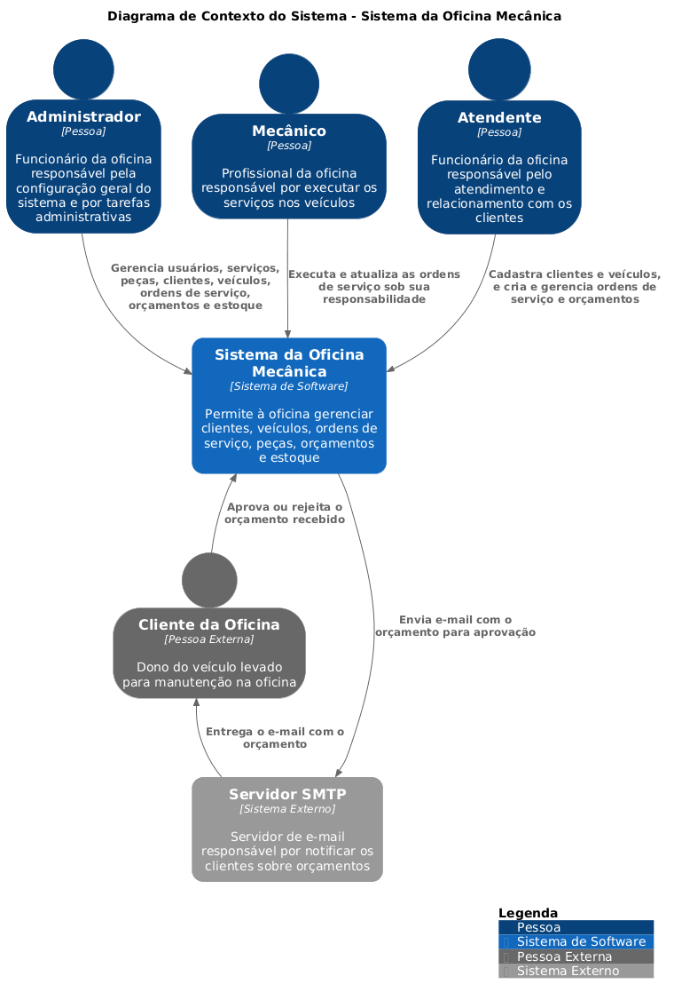
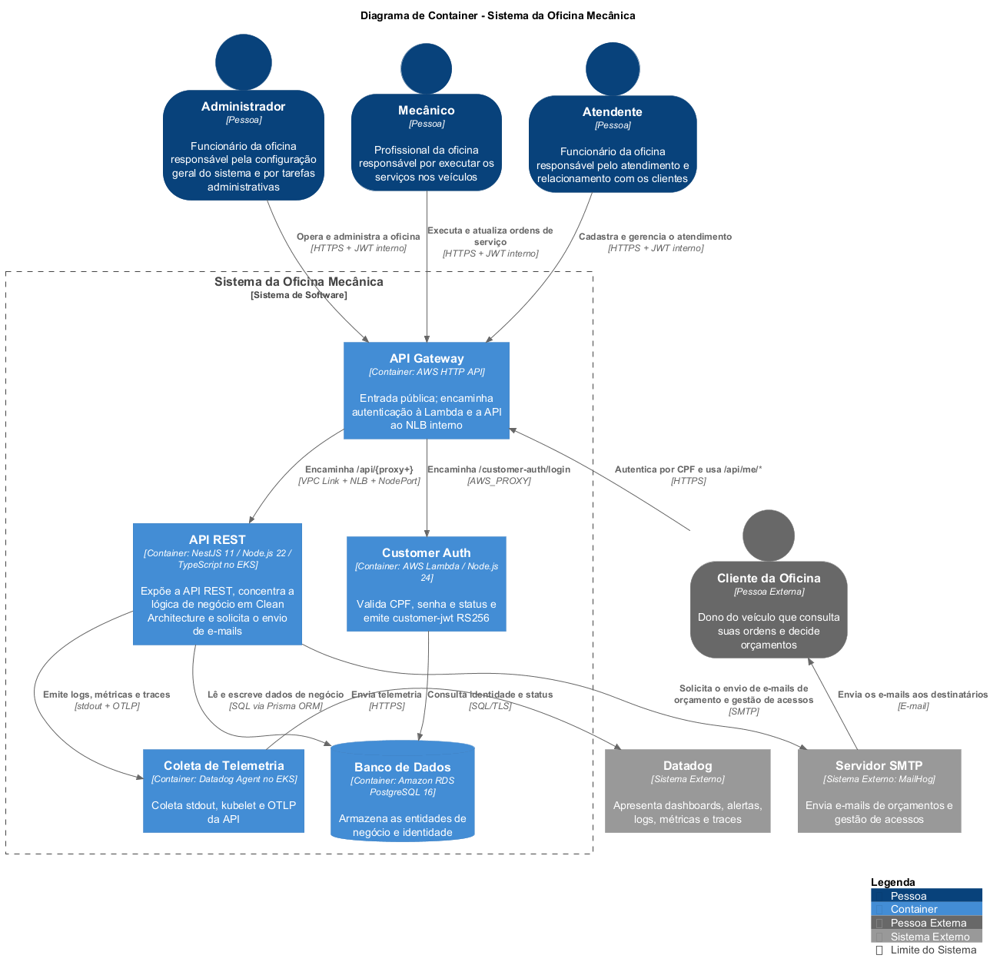
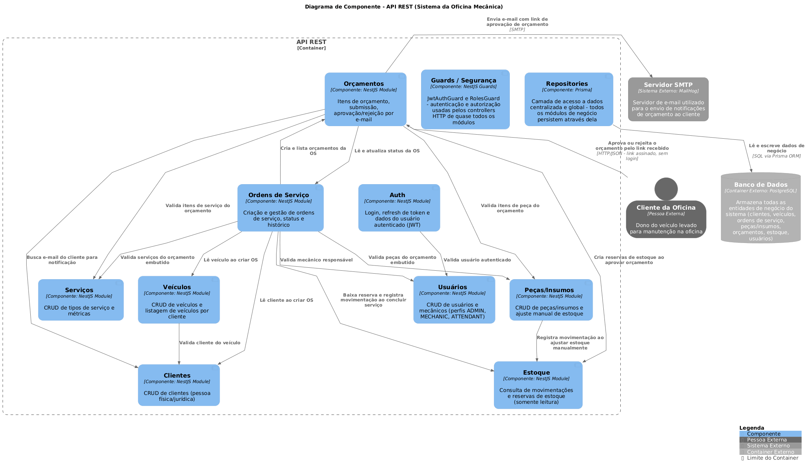

# 🧩 Modelo C4 — Sistema da Oficina Mecânica

Este diretório documenta a arquitetura do **Sistema da Oficina Mecânica** com o [modelo C4](https://c4model.com). O C4 descreve a arquitetura em **níveis de zoom sucessivos** — como aproximar um mapa: o mesmo sistema visto de mais longe (Contexto) ou de mais perto (Container, Componente). O sistema em foco é sempre o mesmo em todos os níveis; só muda o nível de detalhe.

Este projeto documenta os **três primeiros níveis**. Cada seção abaixo traz a imagem do diagrama, a descrição dos elementos e as convenções seguidas.

## Índice

- [Como ler os quatro níveis](#como-ler-os-quatro-níveis)
- [Convenções](#convenções)
- [Nível 1 — Contexto do Sistema](#nível-1--contexto-do-sistema)
- [Nível 2 — Container](#nível-2--container)
- [Nível 3 — Componente da API REST](#nível-3--componente-da-api-rest)
- [Documentação relacionada](#documentação-relacionada)

## Como ler os quatro níveis

O C4 define quatro níveis de detalhe. Cada nível é um zoom a mais sobre o **mesmo** sistema:

| Nível | O que mostra | Neste projeto |
|---|---|---|
| **1 · Contexto** | O sistema, seus usuários e os sistemas externos | ✅ [ver](#nível-1--contexto-do-sistema) |
| **2 · Container** | Os blocos executáveis/implantáveis dentro do sistema | ✅ [ver](#nível-2--container) |
| **3 · Componente** | As peças internas de um container | ✅ [ver](#nível-3--componente-da-api-rest) |
| **4 · Código** | Classes/tabelas de um componente | ➖ fora de escopo |

## Convenções

Convenções seguidas em todos os diagramas, para leitura consistente entre os níveis:

- **Nome único do sistema.** O sistema em foco é sempre **"Sistema da Oficina Mecânica"**, idêntico em Contexto, Container e Componente — é o mesmo sistema, só muda o zoom.
- **Tipo explícito em todo elemento.** Cada elemento declara o tipo entre colchetes (`[Pessoa]`, `[Sistema de Software]`, `[Container: tecnologia]`, `[Componente: tecnologia]`).
- **Pessoas com silhueta.** Os atores usam a silhueta oficial de pessoa (círculo + corpo), como nos exemplos de [c4model.com/diagrams/system-context](https://c4model.com/diagrams/system-context) e [.../container](https://c4model.com/diagrams/container).
- **Ícone de componente.** No diagrama de Componente, cada componente leva o ícone UML clássico (dois retângulos), igual à legenda de [c4model.com/diagrams/component](https://c4model.com/diagrams/component), na mesma paleta azul dos demais elementos.
- **Tecnologia só ao cruzar fronteira.** O rótulo de tecnologia/protocolo (HTTP, JWT, SQL, SMTP…) aparece nas setas apenas a partir do nível de Container. No Contexto as setas trazem só a ação; no Componente, a tecnologia surge apenas quando a seta sai do container para o Banco de Dados ou o Servidor SMTP.

## Nível 1 — Contexto do Sistema

O nível mais macro, pensado para stakeholders **não técnicos**: mostra quem usa o sistema e com quais sistemas externos ele conversa, sem nenhum detalhe interno.

As caixas de pessoa descrevem **quem** cada ator é (não o que faz — a ação fica no rótulo da seta). Nenhuma seta menciona protocolo ou tecnologia, que são detalhe de nível mais baixo. Os nomes também evitam sufixo técnico: **"Sistema da Oficina Mecânica"** (não "...API") e **"Servidor SMTP"** (não "MailHog", que é apenas a implementação de desenvolvimento, revelada só no nível de Container). O **PostgreSQL não aparece** aqui por ser detalhe interno.

| Elemento | Tipo | Papel |
|---|---|---|
| **Administrador** | Pessoa | Responsável pela configuração geral e por tarefas administrativas; gerencia usuários, serviços, peças, clientes, veículos, ordens de serviço, orçamentos e estoque |
| **Mecânico** | Pessoa | Executa e atualiza as ordens de serviço sob sua responsabilidade |
| **Atendente** | Pessoa | Cadastra clientes e veículos; cria e gerencia ordens de serviço e orçamentos |
| **Cliente da Oficina** | Pessoa externa | Dono do veículo levado para manutenção; aprova ou rejeita o orçamento recebido por e-mail |
| **Servidor SMTP** | Sistema externo | Entrega aos clientes os e-mails de orçamento enviados pelo sistema |

## Nível 2 — Container

Um zoom para dentro da fronteira do sistema: os blocos executáveis/implantáveis e como se comunicam.

Dentro do **Sistema da Oficina Mecânica** há **dois containers** — a **API REST** e o **Banco de Dados** —, além do **Servidor SMTP** externo (aqui já com o nome técnico, MailHog). É neste nível que aparecem **tecnologia e protocolo** nas setas, como recomendado. Confirmado por análise de código e infraestrutura que **não há workers, filas ou cache** separados; o Job de migração do Kubernetes reutiliza a mesma imagem da API e por isso **não é modelado como container à parte**.

| Container | Tecnologia | Responsabilidade |
|---|---|---|
| **API REST** | NestJS 11 · Node.js 22 · TypeScript | Expõe a API REST (prefixo `/api`), concentra a lógica de negócio em Clean Architecture, faz autenticação local via JWT e envia os e-mails de orçamento |
| **Banco de Dados** | PostgreSQL | Armazena todas as entidades de negócio (clientes, veículos, ordens de serviço, peças/insumos, orçamentos, estoque, usuários); auto-hospedado no mesmo cluster/infra do time |
| **Servidor SMTP** | MailHog (externo) | Recebe e entrega os e-mails de orçamento (sink SMTP de desenvolvimento) |

Os protocolos nas setas: funcionários chamam a API por **HTTP/JSON REST autenticado via JWT Bearer**; o Cliente da Oficina decide o orçamento por **link assinado, sem login**; a API persiste no banco via **SQL/Prisma ORM** e notifica o cliente por **SMTP**.

## Nível 3 — Componente da API REST

O zoom mais interno: as peças que compõem o container **API REST**.

São **nove módulos de negócio** e **dois componentes transversais**, com as dependências reais entre módulos levantadas no código. Destaques do fluxo: **Ordens de Serviço ↔ Orçamentos** se relacionam nos dois sentidos (a OS cria e lista orçamentos; o orçamento lê e atualiza o status da OS); os **Orçamentos** criam reservas no **Estoque** ao aprovar e disparam e-mail pelo **Servidor SMTP**; e o **Cliente da Oficina** conecta-se **diretamente** ao componente **Orçamentos** (aprovação por link, sem login) — é a única pessoa que interage com um componente específico em vez de passar pela API como um todo.

As dependências de quase todos os módulos em relação a **Guards / Segurança** e **Repositories** estão descritas no texto desses dois componentes, e **não desenhadas como setas** — isso evita cerca de 18 setas repetidas que poluiriam o diagrama sem agregar informação. Como no exemplo oficial (Figura 3 do material da aula), as setas entre componentes do mesmo container não levam rótulo de tecnologia; a tecnologia só aparece quando a seta cruza para o Banco de Dados ou o Servidor SMTP.

**Módulos de negócio**

| Componente | Tecnologia | Responsabilidade |
|---|---|---|
| **Auth** | NestJS Module | Login, refresh de token e dados do usuário autenticado (JWT) |
| **Usuários** | NestJS Module | CRUD de usuários e mecânicos (perfis ADMIN, MECHANIC, ATTENDANT) |
| **Clientes** | NestJS Module | CRUD de clientes (pessoa física/jurídica) |
| **Veículos** | NestJS Module | CRUD de veículos e listagem de veículos por cliente |
| **Serviços** | NestJS Module | CRUD de tipos de serviço e métricas |
| **Peças/Insumos** | NestJS Module | CRUD de peças/insumos e ajuste manual de estoque |
| **Ordens de Serviço** | NestJS Module | Criação e gestão de ordens de serviço, status e histórico |
| **Orçamentos** | NestJS Module | Itens de orçamento, submissão e aprovação/rejeição por e-mail |
| **Estoque** | NestJS Module | Consulta de movimentações e reservas de estoque (somente leitura) |

**Componentes transversais**

| Componente | Tecnologia | Responsabilidade |
|---|---|---|
| **Guards / Segurança** | NestJS Guards | `JwtAuthGuard` e `RolesGuard` — autenticação e autorização usadas pelos controllers HTTP de quase todos os módulos |
| **Repositories** | Prisma | Acesso a dados centralizado e global; todos os módulos de negócio persistem através dele |

## Documentação relacionada

- 🏛️ [Arquitetura](../architecture.md) — Clean Architecture, DDD, ciclos de vida, Unit of Work, exceções.
- 🏗️ [Infra · Visão Geral](../infra/overview.md) — a infraestrutura como sistema (inclui as vistas de deployment).
- 📐 [ADRs](../adr) — decisões arquiteturais.
- 🌐 [c4model.com](https://c4model.com) — referência oficial do modelo C4.
