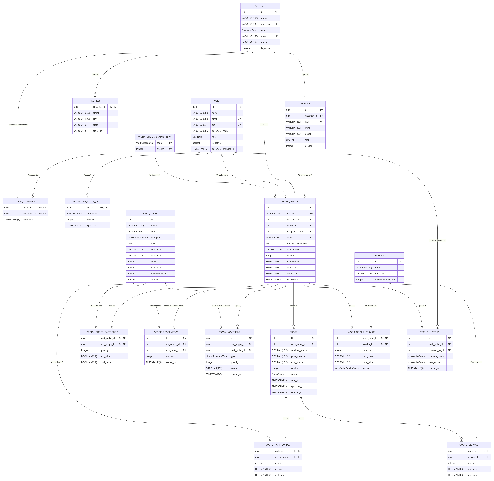

# Banco de Dados

Modelo relacional (PostgreSQL) da API, definido em [`prisma/schema.prisma`](../app/prisma/schema.prisma) e versionado via migrations em [`prisma/migrations/`](../app/prisma/migrations/).

## Diagrama entidade-relacionamento

Os tipos de coluna mostrados no diagrama são os tipos **reais gerados no Postgres** (`VARCHAR(n)`, `TIMESTAMP(3)`, `DECIMAL(10,2)`, os enums nomeados, etc.), conferidos a partir das migrations — não os tipos abstratos do schema Prisma (`String`, `Int`, `DateTime`).

## Tabelas e relacionamentos

### Identidade e acesso

- **`users`** (`User`) — funcionários internos (`ADMIN`, `MECHANIC`, `ATTENDANT`) e também a conta-base de todo Cliente da Oficina que acessa via CPF (`role` nulo nesse caso — ver [ADR 0004](adr/0004-autenticacao-de-clientes.md)). `email` e `cpf` são únicos; `cpf` é opcional (só funcionários com acesso externo o possuem).
- **`customers`** (`Customer`) — clientes da oficina (pessoa física ou jurídica, `type`). `document` (CPF/CNPJ) e `email` são únicos.
- **`user_customers`** (`UserCustomer`) — vínculo N:N entre `users` e `customers` que autoriza o acesso externo por CPF: um `User` pode acessar os dados de um ou mais `Customer` (ex.: um contador que acessa vários clientes PJ). Chave primária composta `(user_id, customer_id)`.
- **`customer_addresses`** (`Address`) — endereço 1:1 de um `Customer`. Chave primária é o próprio `customer_id` (sem id/timestamps próprios); apagado em cascata com o cliente.
- **`password_reset_codes`** (`PasswordResetCode`) — código de redefinição de senha em vigor por usuário (`user_id` como chave primária — no máximo um código ativo por vez), emitido por um Admin.

### Veículos e catálogo

- **`vehicles`** (`Vehicle`) — veículos de um `Customer` (`plate` única). Um cliente pode ter vários veículos; cada veículo pertence a exatamente um cliente.
- **`services`** (`Service`) — catálogo de serviços oferecidos (nome único, preço base).
- **`parts_supplies`** (`PartSupply`) — catálogo de peças e insumos (`category` distingue os dois), com controle de estoque (`stock`, `min_stock`, `reserved_stock`) e concorrência otimista (`version`).

### Ordem de Serviço (OS)

- **`work_order_statuses`** (`WorkOrderStatusInfo`) — tabela de referência (lookup, populada pelo seed): associa cada `WorkOrderStatus` a uma `priority` numérica (1–9), usada para ordenar a listagem de OS por status em ordem de negócio, não alfabética (ver [Ciclo de vida da Ordem de Serviço](architecture.md#ciclo-de-vida-da-ordem-de-serviço)).
- **`work_orders`** (`WorkOrder`) — a Ordem de Serviço, aggregate root do domínio. Referencia um `Customer`, um `Vehicle`, opcionalmente um `User` atribuído (mecânico), e seu `status` é FK para `work_order_statuses`. Concorrência otimista via `version`.
- **`work_order_services`** / **`work_order_part_supplies`** (`WorkOrderService` / `WorkOrderPartSupply`) — itens de linha da OS (serviços e peças/insumos aplicados), com chave primária composta `(work_order_id, service_id | part_supply_id)` em vez de surrogate key. Apagados em cascata com a OS.
- **`status_history`** (`StatusHistory`) — histórico de transições de status de uma OS, com o usuário que efetuou a mudança (`changed_by_id`, opcional).

### Orçamento

- **`quotes`** (`Quote`) — orçamento vinculado a uma OS, também um aggregate root próprio (concorrência otimista via `version`).
- **`quote_services`** / **`quote_part_supplies`** (`QuoteService` / `QuotePartSupply`) — itens de linha do orçamento, mesmo padrão de chave composta dos itens de OS.

### Estoque

- **`stock_movements`** (`StockMovement`) — histórico de entradas/saídas/ajustes de estoque de uma peça/insumo, opcionalmente vinculado à OS que o originou (`work_order_id` nulo em ajustes manuais; `onDelete: SetNull` preserva o histórico mesmo se a OS for excluída).
- **`stock_reservations`** (`StockReservation`) — reserva de estoque de uma peça/insumo para uma OS específica, liberada ou efetivada conforme o ciclo de vida da OS.

## Enums

`UserRole`, `CustomerType`, `WorkOrderStatus`, `WorkOrderServiceStatus`, `QuoteStatus`, `StockMovementType`, `Unit`, `PartSupplyCategory`. `UserRole` **não** ganhou um valor `CUSTOMER` — o acesso externo não é modelado como papel interno (ver [ADR 0004](adr/0004-autenticacao-de-clientes.md)).

## Convenções de modelagem

- **IDs**: `uuid` v4 (`@db.Uuid`) gerados pelo Prisma — exceto o número da OS, gerado por uma **sequence PostgreSQL** (`work_order_number_seq`, formatada com 6 dígitos zero-padded — `000001`, `000002`, …).
- **Timestamps**: `created_at` / `updated_at` em todas as entidades não-imutáveis (`Address`, `StatusHistory`, `StockMovement` e `StockReservation` guardam apenas `created_at`).
- **Concorrência otimista**: coluna `version Int @default(1)` em `WorkOrder`, `Quote` e `PartSupply`.
- **Cascade deletes** para itens dependentes (`WorkOrderService`, `WorkOrderPartSupply`, `QuoteService`, `QuotePartSupply`, `StatusHistory`, `StockReservation`, `Address`).
- **`StockMovement.work_order_id`** usa `onDelete: SetNull` para preservar histórico de movimentação após exclusão da OS.
- **Unicidade**: `User.email`, `User.cpf`, `Customer.email`, `Customer.document`, `Vehicle.plate`, `PartSupply.sku`, `Service.name`, `WorkOrder.number`.
- **Identidades compostas**: `WorkOrderService`, `WorkOrderPartSupply`, `QuoteService` e `QuotePartSupply` usam chave primária composta `(parentId, itemId)` em vez de surrogate key.
- **Índices secundários** por colunas usadas em filtros (`status`, `customer_id`, `vehicle_id`, `assigned_user_id`, `part_supply_id`, `work_order_id`, etc.) e índice composto `(status, created_at)` em `work_orders` para listagens ordenadas.

## Referências

- [ADR 0001 — Uso do PostgreSQL como banco de dados relacional](adr/0001-uso-do-postgresql-como-banco-de-dados.md)
- [ADR 0004 — Autenticação externa de clientes por CPF](adr/0004-autenticacao-de-clientes.md)
- [ADR 0010 — Concorrência otimista via coluna `version`](adr/0010-concorrencia-otimista-via-version.md)
- [`oficina-mecanica-database` — ADRs do banco gerenciado (RDS)](https://github.com/FIAP-15SOAT/oficina-mecanica-database/tree/main/docs/adr)
