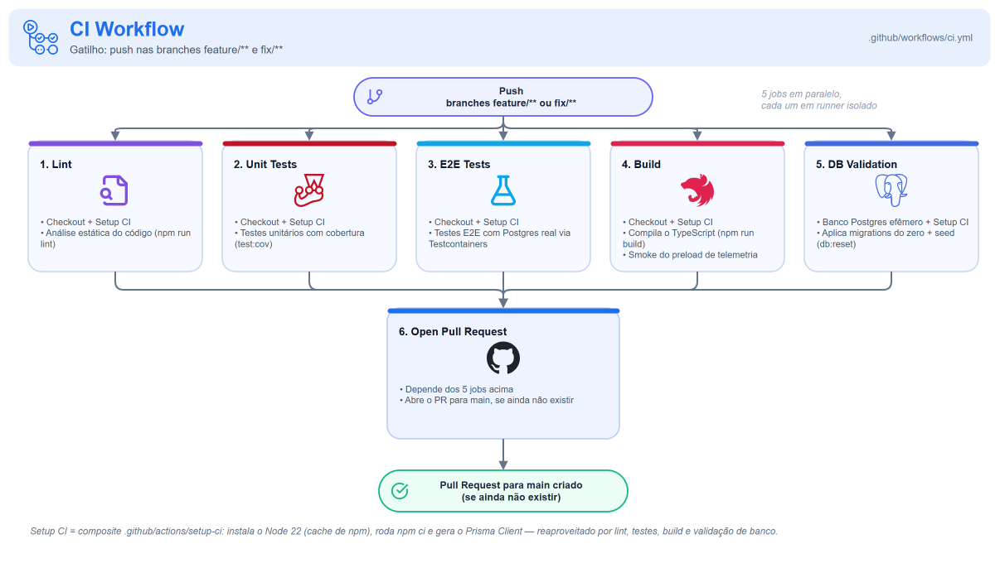
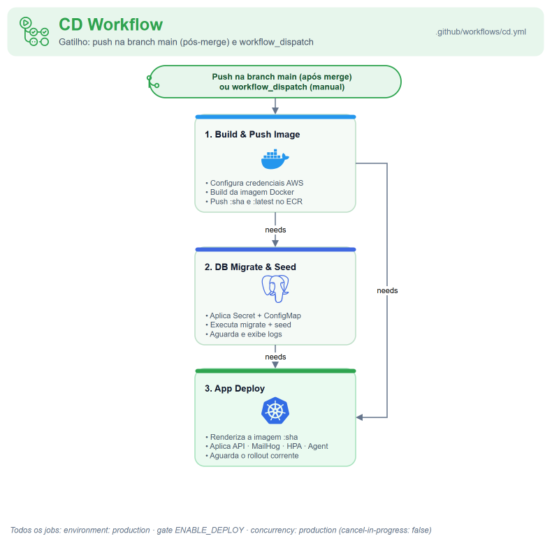
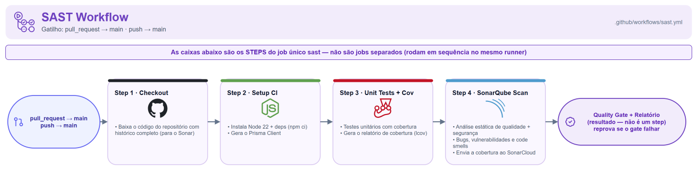
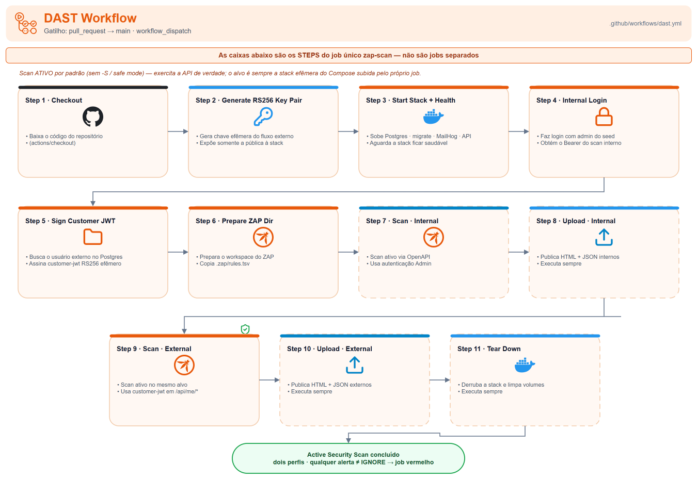

# 🔄 CI/CD

Quatro workflows do GitHub Actions, um por responsabilidade: CI, CD, SAST e DAST.

## Índice

- [Fluxo de branch e Pull Request](#fluxo-de-branch-e-pull-request)
- [Controle de concorrência de runs](#controle-de-concorrência-de-runs)
- [1) Workflow de CI](#1-workflow-de-ci-ciyml)
- [2) Workflow de CD](#2-workflow-de-cd-cdyml)
- [Seed dos dados de referência](#seed-dos-dados-de-referência)
- [3) Workflow de SAST](#3-workflow-de-sast-sastyml)
- [4) Workflow de DAST](#4-workflow-de-dast-dastyml)
- [Secrets e Variables](#secrets-e-variables)

A automação está dividida por responsabilidade, em quatro workflows:

| Workflow | Arquivo | Gatilho | Responsabilidade |
|---|---|---|---|
| CI | `.github/workflows/ci.yml` | `push` em branches de trabalho (`feature/**`, `fix/**`) | Validar a mudança (inclui `terraform plan`) e abrir o PR |
| CD | `.github/workflows/cd.yml` | `push` em `master` (pós-merge) + `workflow_dispatch` | Fluxo de entrega completo: **provisiona a infra (Terraform), builda a imagem, migra o banco e deploya a app** |
| SAST | `.github/workflows/sast.yml` | `pull_request` + `push` em `master` | Análise do SonarCloud (PR + `master`), em paralelo ao CD (não bloqueia o deploy) |
| DAST | `.github/workflows/dast.yml` | `pull_request` → `master` + `workflow_dispatch` | Scan ativo OWASP ZAP da API em execução (autenticado, via OpenAPI), em paralelo ao CI/CD |

O CD faz o **fluxo de entrega ponta a ponta**: aplica o Terraform (infra) **antes** de migrar e deployar. Não há acoplamento por `workflow_run` — a ordem é garantida pelas dependências entre jobs (`needs:`) dentro do próprio CD. Seguindo a prática do HashiCorp, o **`terraform plan` roda no CI** (o revisor vê o diff de infra no PR) e o **`terraform apply` roda no CD** — o merge na `master` (protegida, só via PR com checks verdes) é a aprovação.

> **Como ler os diagramas.** Nos diagramas de **CI** e **CD**, cada caixa é um **job** (com os principais steps em bullets) e as setas seguem as dependências `needs:`. Nos de **SAST** e **DAST** — que têm um **único job** —, cada caixa é um **step**, executado em sequência no mesmo runner.

## Fluxo de branch e Pull Request

O CI dispara no `push` de uma branch de trabalho e roda todos os jobs de validação em paralelo (fail-fast). Se todos passam, o job `open-pr` abre um Pull Request para `master` — de forma idempotente (não abre duplicado se já existir PR); em pushes seguintes, o CI reexecuta e o `open-pr` vira no-op.

Os jobs pesados **não** são disparados por `pull_request`. O evento `pull_request` (ação `synchronize`) já reexecuta a cada novo push numa branch com PR aberto; disparar por `push` **e** por `pull_request` executaria tudo em dobro. Mantendo o gatilho apenas em `push`, cada commit é validado uma única vez — os check-runs ficam gravados no SHA do commit, e a branch protection da `master` (required status checks) os lê para liberar ou bloquear o merge.

## Controle de concorrência de runs

| Workflow | `group` | `cancel-in-progress` | Porquê |
|---|---|---|---|
| `ci.yml` | `ci-<ref>` | `true` | Um push mais novo torna o run anterior obsoleto; cancelar economiza runners |
| `cd.yml` | `production` | `false` | Nunca interromper um `terraform apply`/deploy no meio; o próximo run enfileira atrás (protege o state do Terraform e o rollout) |
| `sast.yml` | `sast-<pr ou ref>` | `true` | Um push novo no PR/`master` torna a análise anterior obsoleta; cancelar economiza runners |
| `dast.yml` | `dast-<pr ou ref>` | `true` | Um push novo no PR torna o scan anterior obsoleto; cancelar economiza runners |

Todos os jobs do CD rodam sob o GitHub `environment: production` (portão de deploy / regras de proteção) e são gated por `vars.ENABLE_APP_DEPLOY` — o interruptor mestre do fluxo cloud: quando `false`, o CD não provisiona nem deploya (útil quando o lab do Academy está desligado).

## 1) Workflow de CI (`ci.yml`)

Escopo: validação de qualquer branch de trabalho, sempre por completo (sem detecção condicional de mudança — determinístico e consistente).

Os 5 jobs de validação rodam **em paralelo** (fail-fast); passando todos, o `open-pr` abre o PR. Os jobs usam o composite `.github/actions/setup-ci` (Node com cache de npm + `npm ci` + `prisma generate`, tudo em `app/`); todas as actions de terceiros são fixadas por commit SHA completo (mitigação de supply-chain).

| # | Job | O que faz |
|---|---|---|
| 1 | `lint` | `npm run lint` — ESLint (inclui a cerca de dependências entre camadas) |
| 2 | `unit-tests` | `npm run test:cov` — testes unitários com cobertura |
| 3 | `e2e-tests` | `npm run test:e2e:cov` — E2E com um PostgreSQL descartável via Testcontainers no próprio job |
| 4 | `build` | `npm run build` — compila o TypeScript |
| 5 | `db-validation` | Sobe um PostgreSQL efêmero (service container) e roda `npm run db:reset` (migrate reset + seed): prova que as migrations aplicam do zero e o seed funciona. Banco descartado com o job — nunca toca ambiente real |
| 6 | `open-pr` | `needs:` os 5 jobs acima; abre o PR para `master` de forma idempotente (não duplica), com o PAT `OPEN_PR_TOKEN` para que o `sast.yml` rode no PR desde o primeiro push |

> As validações de Terraform (`fmt`, `validate`, `plan`) são executadas nos repositórios dedicados de infraestrutura ([`oficina-mecanica-infra-base`](https://github.com/FIAP-15SOAT/oficina-mecanica-infra-base) e [`oficina-mecanica-k8s`](https://github.com/FIAP-15SOAT/oficina-mecanica-k8s)).

## 2) Workflow de CD (`cd.yml`)

Escopo: `push` em `master` (após o merge) e `workflow_dispatch` (deploy sob demanda). Roda sob `environment: production`, com concorrência que não cancela execução em andamento. Todos os jobs são condicionados por `vars.ENABLE_DEPLOY == 'true' || github.event_name == 'workflow_dispatch'`. A ordem é um **DAG por `needs:`**: `build-push-image` → `db-migrate` → `app-deploy`.

| # | Job | `needs:` | O que faz |
|---|---|---|---|
| 1 | `build-push-image` | — | Login no Amazon ECR, build **único** da imagem multi-stage NestJS e push com tags imutáveis (`:sha` e `:latest`); exporta o `image_uri` |
| 2 | `db-migrate` | `build-push-image` | Configura o kubeconfig, **renderiza `k8s/00-db-migrate-job.yaml`** (nome único por run + imagem imutável via `sed`) e aplica o Kubernetes Job: **`prisma migrate deploy` + `prisma db seed`** — só migrations pendentes (não-destrutivo, nunca reseta) e seed idempotente (`upsert`, sem duplicar). Aguarda a conclusão com timeout e logs |
| 3 | `app-deploy` | `build-push-image` + `db-migrate` | Renderiza `k8s/01-api-secret.yaml` (secrets da app via `envsubst`) e `k8s/03-api-deployment.yaml` (imagem imutável) e aplica os manifests Kubernetes — `Secret` e `ConfigMap` da API, o **MailHog** (`Deployment` + `Service`) e o `Deployment`/`Service`/`HPA` da API; valida o rollout |

A imagem roda **somente a aplicação** (`CMD ["node", "--require", "./dist/src/otel.js", "dist/src/main"]` — o `--require` é o preload do OpenTelemetry, que precisa rodar antes de `express` e `pg` serem importados). A migração é um passo dedicado — o Job de `db-migrate` no cluster e o serviço one-shot `migrate` no `docker-compose.yml` localmente — nunca embutida no start do container. Isso evita corrida de migração entre réplicas (o HPA escala de 1 a 5 pods) e mantém o mesmo formato local e em produção.

## Seed dos dados de referência

O seed **não** é um passo destrutivo. Como os seeds são idempotentes (`upsert`, sem duplicar; para usuários, a senha só é definida na criação e não é sobrescrita), ele roda junto com a migração no job `db-migrate` (`migrate deploy` + `db seed`) a cada deploy. Assim os dados de referência (incluindo os usuários Admin) são reafirmados sem apagar nada, e um ambiente cujo armazenamento tenha sido perdido se auto-recupera no próximo deploy, sem passo manual.

## 3) Workflow de SAST (`sast.yml`)

> Este workflow tem **um único job (`sast`)**: no diagrama acima, cada caixa é um **step** (rodam em sequência no mesmo runner), não um job.

| # | Step | O que faz |
|---|---|---|
| 1 | Checkout | `actions/checkout` com `fetch-depth: 0` (histórico completo, exigido pelo Sonar) |
| 2 | Setup CI | composite `setup-ci`: Node 22 + cache npm, `npm ci`, `prisma generate` |
| 3 | Unit tests with coverage | `npm run test:cov` — gera o `lcov.info` consumido pelo Sonar |
| 4 | SonarQube Scan | `SonarSource/sonarqube-scan-action` (`projectBaseDir: app`, autenticado por `SONAR_TOKEN`) |
| → | *resultado — Quality Gate* | com `sonar.qualitygate.wait=true` o run fica **vermelho** se o gate reprovar (não é um step) |

Análise do SonarCloud num workflow dedicado. O plano do Sonar do projeto analisa apenas a **branch principal (`master`) e Pull Requests** — não branches de trabalho avulsas —, então o SAST **saiu do CI e do CD** e roda aqui:

- **`pull_request` → `master`**: análise em modo PR (detecção de _New Code_ + decoração do PR).
- **`push` → `master`**: análise da branch principal (relatório consolidado + o baseline que a análise de PR usa como referência).

Roda `test:cov` + Sonar Scan (`projectBaseDir: app`). Com `sonar.qualitygate.wait=true` (em `sonar-project.properties`), o run **fica vermelho se o quality gate reprovar**. Por ser um workflow **separado do CD**, uma análise vermelha na `master` **não bloqueia o deploy** (rodam em paralelo). A configuração do Sonar (chave do projeto, organização, exclusões, caminho do `lcov.info`) está em `sonar-project.properties`.

Como o `open-pr` abre o PR com um **PAT** (`OPEN_PR_TOKEN`) em vez do `GITHUB_TOKEN`, a criação do PR dispara o `sast.yml` — então a análise/decoração aparece **desde o primeiro push** (o `GITHUB_TOKEN` não dispararia workflows no PR criado automaticamente).

## 4) Workflow de DAST (`dast.yml`)

> Este workflow tem **um único job (`zap-scan`)**: no diagrama acima, cada caixa é um **step**, não um job. As caixas *Start stack* e *Wait API ready* correspondem ao step único que sobe a stack e espera o healthcheck do serviço `api`. Os steps `Upload report` e `Tear down` rodam com `if: always()` (tracejados no diagrama).

| # | Step | O que faz |
|---|---|---|
| 1 | Checkout | `actions/checkout` |
| 2 | Start the target stack and wait for it to become healthy | `docker compose -p dast up -d --build --wait --wait-timeout 180` — sobe a stack prod-like (Postgres + `migrate` + MailHog + API) e espera o **healthcheck do serviço `api`**; na expiração publica `compose ps --all` + `logs` e falha |
| 3 | Perform authentication | `POST /api/auth/login` com um admin do seed → JWT; injetado como `Authorization: Bearer` no _replacer_ do ZAP |
| 4 | Prepare the ZAP work directory | `mkdir zap-work`, copia `.zap/rules.tsv`, `chmod` |
| 5 | Run OWASP ZAP API scan | `zap-api-scan.py -t /api/docs-json -f openapi` — **scan ativo**, na rede `dast_default`; gera relatório HTML + JSON |
| 6 | Upload the ZAP report | `if: always()` — sobe o artifact `zap-report` (HTML + JSON) mesmo se o job falhar |
| 7 | Tear down the stack | `if: always()` — `docker compose down -v` |
| → | *resultado* | job fica **vermelho** se houver qualquer alerta ≠ `IGNORE` |

Teste dinâmico de segurança (**DAST**) com **OWASP ZAP**, num workflow dedicado — como o SAST, roda em paralelo ao CI/CD e não bloqueia nenhum deles. Diferente do SAST (separado por limitação do plano do Sonar), o DAST é separado por ter um **ciclo de gatilho próprio**:

- **`pull_request` → `master`**: escaneia o candidato a merge — o gate natural do DAST.
- **`workflow_dispatch`**: execução sob demanda.

Deliberadamente **não** roda em `push` de branch de trabalho (o CI já cobre o loop rápido; subir a stack inteira a cada push seria caro e redundante) nem em `push` → `master` (a `master` é protegida — só entra via PR —, então o scan do PR já cobriu aquele código).

O job sobe a **stack prod-like inteira** a partir do `app/docker-compose.yml` (`-p dast`: `postgres` + `migrate` = `prisma migrate deploy` + `db seed` + `mailhog` + `api` com `NODE_ENV=production`), faz login em `POST /api/auth/login` com um admin do seed e roda o `zap-api-scan.py` (`-f openapi`) contra a spec em `/api/docs-json`. Como quase toda rota está atrás do `JwtAuthGuard`, o token JWT é injetado em cada requisição via _replacer_ do ZAP (`ZAP_AUTH_HEADER*`) — sem isso o scan só veria `401`.

**O portão de prontidão é o healthcheck do próprio serviço `api`**, declarado uma vez no `app/docker-compose.yml` (`wget` do BusyBox contra `/api/health/ready`) e consumido pelo `up --wait` — não um laço de espera mantido em paralelo no workflow, que divergiria do endpoint que o orquestrador de fato consulta.

- **O que o portão prova.** Que a aplicação **alcança o banco** — é o mesmo endpoint que o `readinessProbe` do k8s consulta, e é a mesma definição de "pronto" nos dois lugares.
- **O que o portão *não* prova.** Ele **não** garante que as migrations rodaram nem que o seed existe. Essa garantia vem do `depends_on: migrate: service_completed_successfully` do Compose, e as duas são **distintas**. Confundi-las convida a regressão em que a prontidão fica verde contra um schema vazio e as falhas do scan parecem achados em vez de artefato de ordem.

O `--wait` sai com código diferente de zero na expiração, e o step seguinte não rodaria — por isso o diagnóstico (`compose ps --all` e `logs`) é publicado de dentro do próprio step, e uma stack que nunca fica pronta falha rápido e de forma diagnosticável em vez de pendurar. O serviço `migrate`, que sai com código 0 sob `service_completed_successfully`, **não** invalida o `--wait`. Todos os steps invocam `docker compose` sem `-f`/`-p`: `COMPOSE_FILE` e `COMPOSE_PROJECT_NAME` estão no `env` do workflow e são lidos nativamente pela CLI.

O sink de e-mail é tratado do mesmo jeito: esperar a stack prova que o container do MailHog está rodando, não que a porta SMTP aceita conexões. Se o scan passar a depender de entrega de e-mail — e não apenas da ausência de recusa de conexão —, quem declara essa condição é o **próprio serviço MailHog**; a prontidão da API não é estendida para cobri-lo.

As duas rotas de saúde são públicas e aparecem no `/api/docs-json`, então **são escaneadas ativamente como qualquer outra**. Escondê-las da spec para evitar o scan não é opção: são superfície não autenticada, e é exatamente isso que o scan existe para exercitar.

O ZAP roda **na rede do compose** (`--network dast_default`, alvo `http://api:3000`): alcança a API pelo nome do serviço e escaneia a mesma imagem que o CD entrega — dá paridade com produção e evita o clássico problema de `localhost` resolver para o próprio container do ZAP. O `.zap/rules.tsv` silencia alertas que não se aplicam a uma API stateless com Bearer JWT (ausência de token anti-CSRF, três flags de cookie de sessão) e o falso-positivo de XSS refletido em resposta JSON (`40014` — `Content-Type: application/json`, que o navegador nunca executa como HTML).

O job **falha se o ZAP encontrar problemas** — qualquer alerta não marcado como `IGNORE` faz o `zap-api-scan.py` sair com código diferente de zero e o job fica **vermelho**, como acontece com o SAST. O relatório (HTML + JSON) **não se perde**: sobe como artifact do run mesmo quando o job falha (upload com `if: always()`). O `.zap/rules.tsv` é a alavanca de calibração — os primeiros runs provavelmente ficam vermelhos até você marcar os falsos-positivos como `IGNORE` (se falhar em todo WARN for agressivo demais, dá para usar `-I` e marcar como `FAIL` só as regras que devem bloquear). As credenciais do admin do seed vêm de **secrets do repositório** (`SEED_ADMIN_EMAIL`, `SEED_ADMIN_PASSWORD`), nunca hardcoded, e são usadas só contra o banco descartável do job. O `zap-api-scan.py` roda por padrão um **scan ativo** afinado para APIs (importa a spec OpenAPI e exercita os endpoints) — como o alvo é sempre a stack efêmera do job, nunca um ambiente real, eventuais escritas são inofensivas.

## Secrets e Variables

Para que os workflows e o provisionamento funcionem corretamente, é necessário configurar os secrets e variables do repositório no GitHub. A tabela abaixo é a referência prática de configuração, incluindo onde cada item é usado.

| Tipo | Nome | Usado em | Finalidade |
|---|---|---|---|
| Secret | `AWS_ACCESS_KEY_ID` | `ci.yml`, `cd.yml` | Credencial AWS (Academy) para validação e deploy |
| Secret | `AWS_SECRET_ACCESS_KEY` | `ci.yml`, `cd.yml` | Segredo complementar da credencial AWS |
| Secret | `AWS_SESSION_TOKEN` | `cd.yml` | Token temporário de sessão (Academy) — expira e precisa ser renovado a cada lab |
| Secret | `SONAR_TOKEN` | `sast.yml` | Autenticação do SonarQube Scan (workflow de SAST: PR + `master`) |
| Secret | `SEED_ADMIN_EMAIL` | `dast.yml` | E-mail do admin do seed usado no login que autentica o scan ZAP (só contra o banco descartável do job) |
| Secret | `SEED_ADMIN_PASSWORD` | `dast.yml` | Senha do admin do seed para o mesmo login — secret para não expor no arquivo do workflow e mascarar nos logs |
| Secret | `OPEN_PR_TOKEN` | `ci.yml` | PAT que o job `open-pr` usa para abrir o PR de modo que dispare o `sast.yml` no PR (o `GITHUB_TOKEN` não dispara workflows) |
| Secret | `DB_PASSWORD` | `cd.yml` | Senha do PostgreSQL RDS: consumida no `db-migrate` para renderizar a `DATABASE_URL` no Secret da aplicação (`01-api-secret.yaml`) |
| Secret | `JWT_SECRET` | `cd.yml` | Assinatura dos access tokens JWT |
| Secret | `JWT_REFRESH_SECRET` | `cd.yml` | Assinatura dos refresh tokens JWT |
| Secret | `QUOTE_DECISION_TOKEN_SECRET` | `cd.yml` | Assinatura dos tokens de aprovação/rejeição de orçamento enviados por e-mail |
| Variable | `DB_HOST` | `cd.yml` | Endereço DNS do banco RDS (ex: `rds-oficina-mecanica.xxxx.us-east-1.rds.amazonaws.com`) |
| Variable | `DB_USER` | `cd.yml` | Usuário do banco PostgreSQL (padrão: `techchallenge`) |
| Variable | `DB_PORT` | `cd.yml` | Porta do PostgreSQL (padrão: `5432`) |
| Variable | `DB_NAME` | `cd.yml` | Nome da base de dados (padrão: `techchallenge`) |
| Variable | `PRISMA_GENERATE_DATABASE_URL` | `ci.yml`, `cd.yml` | URL fake usada apenas pelo `prisma generate` (só parseada, nunca conectada); há fallback embutido nos workflows |
| Variable | `ECR_REPOSITORY` | `cd.yml` | Nome do repositório ECR onde a imagem da aplicação é publicada |
| Variable | `EKS_CLUSTER_NAME` | `cd.yml` | Nome do cluster EKS usado para `aws eks update-kubeconfig` |
| Variable | `K8S_DEPLOYMENT_NAME` | `cd.yml` | Nome do Deployment usado no `kubectl rollout status` |
| Variable | `K8S_NAMESPACE` | `cd.yml` | Namespace onde a aplicação e os Jobs de banco são aplicados |
| Variable | `ENABLE_DEPLOY` | `cd.yml` | Habilita ou desabilita os jobs que tocam o cluster (`build-push-image`, `db-migrate`, `app-deploy`) |

Os secrets ficam no nível do repositório ou organização porque são consumidos por mais de um contexto. Como as credenciais são de laboratório do AWS Academy, o `AWS_SESSION_TOKEN` expira quando o lab é reiniciado e precisa ser reconfigurado a cada sessão.

### Injeção de secrets da aplicação

- O secret `DB_PASSWORD` deve ser idêntico ao configurado no repositório `oficina-mecanica-database`.
- No workflow de deploy (`cd.yml`), o job `db-migrate` renderiza o manifesto `k8s/01-api-secret.yaml` via `envsubst` com os valores de `DB_HOST`, `DB_USER`, `DB_PORT`, `DB_NAME` e `DB_PASSWORD`, preenchendo a `DATABASE_URL` consumida pela API e pelo Job de migração.
- Além das credenciais do PostgreSQL RDS, o workflow também injeta os secrets:
  - `JWT_SECRET`
  - `JWT_REFRESH_SECRET`
  - `QUOTE_DECISION_TOKEN_SECRET`
