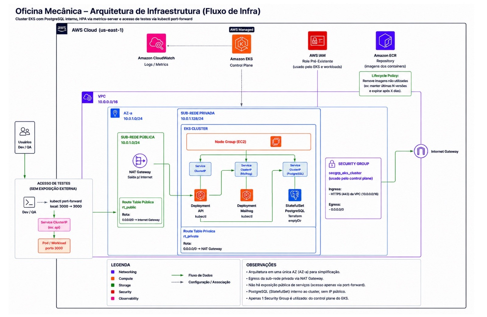
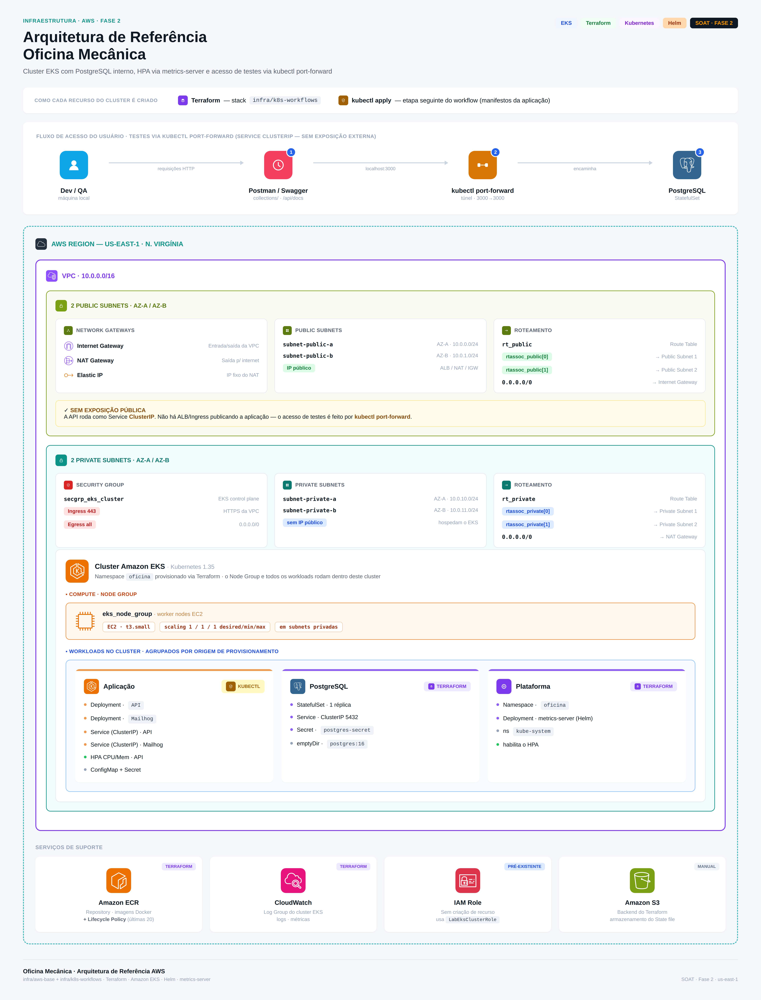

# 🏗️ Infraestrutura · Visão Geral

Este documento detalha a infraestrutura aplicada no projeto: descreve o deploy em **AWS + Amazon EKS** como um **sistema único** — quais são os componentes, quem provisiona cada um, quem chama quem em tempo de execução e para que serve cada recurso. Os detalhes por ferramenta ficam nos aprofundamentos de [Terraform](terraform.md), [Kubernetes](kubernetes.md) e [CI/CD](ci-cd.md), referenciados ao longo da documentação.

A solução roda inteiramente na região **`us-east-1`**, dentro de uma única VPC, num cluster EKS com PostgreSQL interno, autoscaling de pods via `metrics-server`/HPA e **sem exposição pública** da aplicação (acesso de testes apenas por `kubectl port-forward`). O ambiente é um **`prod-simulated`** de laboratório (AWS Academy), o que motiva várias das escolhas minimalistas discutidas em [Limitações](#limitações-e-o-que-produção-exigiria).

## Índice

- [Como ler os dois desenhos](#como-ler-os-dois-desenhos)
- [As três camadas de provisionamento](#as-três-camadas-de-provisionamento)
- [Inventário de componentes e ownership](#inventário-de-componentes-e-ownership)
- [Topologia de rede](#topologia-de-rede)
- [Fluxo em tempo de execução (quem chama quem)](#fluxo-em-tempo-de-execução-quem-chama-quem)
- [Fluxo de provisionamento (ordem de criação)](#fluxo-de-provisionamento-ordem-de-criação)
- [Postura de segurança](#postura-de-segurança)
- [Limitações e o que produção exigiria](#limitações-e-o-que-produção-exigiria)
- [Documentação relacionada](#documentação-relacionada)

## Como ler os dois desenhos

A infraestrutura é documentada por **duas vistas complementares**. Ler as duas em conjunto evita confusão, porque elas têm propósitos diferentes — e **níveis de fidelidade diferentes**.

**1) Vista lógica / de conexões** — mostra os componentes e o fluxo entre eles (quem fala com quem), priorizando a clareza do desenho sobre a precisão topológica.

<p align="center"></p>

> ⚠️ **Este desenho é uma simplificação de uma única AZ** (ele mesmo declara isso em "Observações"). Para reduzir ruído visual, representa **uma** zona de disponibilidade e usa CIDRs ilustrativos (`pública 10.0.1.0/24`, `privada 10.0.1.128/24`) que **não correspondem** ao que o Terraform provisiona. A rede real tem **duas** AZs e outros CIDRs — use a vista física abaixo (e a seção [Topologia de rede](#topologia-de-rede)) como fonte da verdade sobre o endereçamento.

**2) Vista física / de recursos** — detalha os recursos como são realmente provisionados (duas AZs, CIDRs reais, tipo de instância, políticas). Esta vista **bate com o IaC**.

<p align="center"></p>

## As três camadas de provisionamento

A infraestrutura é criada em **três camadas** com ciclos de vida distintos — a divisão é deliberada (recursos estáveis no Terraform, recursos que mudam a cada deploy em manifests aplicados pelo pipeline):

| # | Camada | Ferramenta | O que provisiona | Estado |
|---|---|---|---|---|
| 1 | `infra/aws-base` | Terraform | Rede (VPC, subnets, IGW, NAT), EKS (control plane + node group), ECR, CloudWatch, Security Group | S3 `infra/prod-simulated/aws-base/terraform.tfstate` |
| 2 | `infra/k8s-base` | Terraform | Namespace, PostgreSQL (StatefulSet/Service/Secret), `metrics-server` | S3 `infra/prod-simulated/k8s-base/terraform.tfstate` |
| 3 | `k8s/*.yaml` | **CD (`kubectl`)** | API (Deployment/Service/HPA), ConfigMap, Secret, MailHog, Job de migração | Sem state — reaplicado a cada deploy |

Os dois stacks Terraform têm **states separados** porque o provider Kubernetes da camada 2 é configurado a partir dos **outputs** da camada 1 (endpoint, CA e token do cluster, via `terraform_remote_state`) — criar o cluster e usá-lo no mesmo state seria um problema de _chicken-and-egg_. A camada 3 não é Terraform: são manifests declarativos aplicados pelo pipeline de CD, porque imagem, envs e escala mudam com muito mais frequência que a plataforma. Detalhes da divisão em [kubernetes.md › Motivo da divisão](kubernetes.md#motivo-da-divisão) e [terraform.md](terraform.md).

## Inventário de componentes e ownership

O mapa **"quem provisiona o quê / para que serve"**, agrupado pelas três camadas. Os caminhos são a fonte da verdade — se este documento divergir deles, o código vence.

### Camada 1 — `infra/aws-base` (Terraform)

| Recurso | Definido em | Finalidade |
|---|---|---|
| **VPC** `10.0.0.0/16` | `networking.tf` | Rede isolada que hospeda todo o cluster; DNS support/hostnames habilitados |
| **2 subnets públicas** (`10.0.0.0/24`, `10.0.1.0/24`) | `networking.tf` | Hospedam o NAT Gateway; `map_public_ip_on_launch`; tag `kubernetes.io/role/elb` |
| **2 subnets privadas** (`10.0.10.0/24`, `10.0.11.0/24`) | `networking.tf` | Hospedam os nodes do EKS; sem IP público; tag `kubernetes.io/role/internal-elb` |
| **Internet Gateway** | `networking.tf` | Entrada/saída pública da VPC (rota das subnets públicas) |
| **NAT Gateway + Elastic IP** | `networking.tf` | Egresso das subnets privadas para a internet, com IP fixo; **único**, na `public[0]` |
| **Route tables** (`rt_public`, `rt_private`) | `networking.tf` | `rt_public` → IGW; `rt_private` → NAT Gateway |
| **Security Group** `secgrp-eks-cluster-*` | `eks.tf` | Control plane do EKS: ingress `443` **da CIDR da VPC**, egress `0.0.0.0/0` |
| **CloudWatch Log Group** | `eks.tf` | Logs do control plane (`api`, `audit`, `authenticator`, `controllerManager`, `scheduler`); retenção **14 dias** |
| **EKS cluster** (`1.35`) | `eks.tf` | Control plane Kubernetes gerenciado; endpoint **público e privado**; usa IAM roles **pré-existentes** (lidas via `data`, não criadas) |
| **EKS node group** (`t3.small`, `1/1/1`) | `eks.tf` | Worker nodes EC2 nas **subnets privadas**; `desired = min = max = 1` |
| **ECR** (+ lifecycle policy) | `ecr.tf` | Registry das imagens da API; `scan_on_push`; criptografia `AES256`; **mantém as últimas 20 imagens** |

> As IAM roles `LabEksClusterRole` / `LabEksNodeRole` **não** são provisionadas — são pré-existentes do laboratório e apenas **lidas** via `data "aws_iam_role"`. Essa restrição (AWS Academy bloqueia criação de IAM) tem impacto direto no armazenamento do banco — ver [Limitações](#limitações-e-o-que-produção-exigiria).

### Camada 2 — `infra/k8s-base` (Terraform)

| Recurso | Definido em | Finalidade |
|---|---|---|
| **Namespace** `oficina` | `k8s_namespace.tf` | Namespace compartilhado de toda a solução |
| **Secret** `postgres-secret` | `k8s_postgres.tf` | `POSTGRES_DB=techchallenge`, `POSTGRES_USER=postgres`, `POSTGRES_PASSWORD` (injetado pelo CI) |
| **Service** `postgres` (ClusterIP `5432`) | `k8s_postgres.tf` | DNS estável `postgres.oficina.svc.cluster.local` para o banco |
| **StatefulSet** `postgres` (`postgres:16-alpine`) | `k8s_postgres.tf` | Banco no cluster; 1 réplica; volume **`emptyDir`** (efêmero); probes `pg_isready` |
| **metrics-server** (Helm `3.13.0`) | `k8s_metrics_server.tf` | Métricas de CPU/memória em `kube-system`; **habilita o HPA** |

### Camada 3 — `k8s/*.yaml` (aplicado pelo CD via `kubectl`)

| Recurso | Manifesto | Finalidade |
|---|---|---|
| **Job** `db-migrate` (one-shot) | `00-db-migrate-job.yaml` | `prisma migrate deploy` + `db seed`; renderizado por run; TTL de 14 dias; `backoffLimit: 0` |
| **Secret** `api-secret` | `01-api-secret.yaml` | `DATABASE_URL` + `JWT_SECRET` / `JWT_REFRESH_SECRET` / `QUOTE_DECISION_TOKEN_SECRET` |
| **ConfigMap** `api-config` | `02-api-configmap.yaml` | Envs não-sensíveis (`NODE_ENV`, `PORT`, expirações JWT, `BCRYPT_SALT_ROUNDS`, `MAIL_HOST/PORT`, `TZ`) |
| **Deployment** `oficina-api` | `03-api-deployment.yaml` | A API NestJS; 1 réplica; `:sha` imutável; probes em `/api/docs` |
| **Deployment** `mailhog` | `03-mailhog-deployment.yaml` | Sink SMTP de desenvolvimento (captura e-mails de orçamento) |
| **Service** `oficina-api` (ClusterIP `3000`) | `04-api-service.yaml` | Expõe a API **dentro** do cluster |
| **Service** `mailhog` (ClusterIP `1025`/`8025`) | `04-mailhog-service.yaml` | SMTP (`1025`) + interface web (`8025`) |
| **HPA** `oficina-api-hpa` (`1`→`5`) | `05-api-hpa.yaml` | Autoscaling da API por CPU (70%) e memória (80%) |

## Topologia de rede

Fiel a `infra/aws-base/networking.tf` e `variables.tf` (a **vista física** acima ilustra o mesmo):

- **VPC** `10.0.0.0/16`, nas **2 primeiras AZs** de `us-east-1` (`slice(azs, 0, 2)` → `us-east-1a`, `us-east-1b`).
- **Subnets públicas**: `10.0.0.0/24` (AZ-a) e `10.0.1.0/24` (AZ-b) — associadas à `rt_public` (rota `0.0.0.0/0` → **Internet Gateway**). Hospedam o NAT Gateway.
- **Subnets privadas**: `10.0.10.0/24` (AZ-a) e `10.0.11.0/24` (AZ-b) — associadas à `rt_private` (rota `0.0.0.0/0` → **NAT Gateway**). Hospedam os nodes do EKS.
- **Um** Internet Gateway e **um** NAT Gateway (+ Elastic IP), este na `public[0]`.
- **Security Group** do control plane: ingress **`443` apenas da CIDR da VPC**; egress liberado.

> Existem **duas** subnets por camada porque o EKS **exige ≥ 2 AZs** — há inclusive um bloco `validation` em `variables.tf` que falha o `plan` com menos de 2 CIDRs. Isso é um requisito do control plane, **não** alta disponibilidade do workload — ver [Limitações](#limitações-e-o-que-produção-exigiria).

## Fluxo em tempo de execução (quem chama quem)

Como não há ALB/Ingress, o acesso de testes entra por um túnel `kubectl port-forward`; a partir daí tudo é comunicação **intra-cluster** por DNS de Service (ClusterIP):

```
Dev/QA ──┤ kubectl port-forward 3000:3000 ├──▶ Service oficina-api (ClusterIP :3000)
                                                        │
                                                        ▼
                                               Pod oficina-api (:3000)
                                     DATABASE_URL │        │ MAIL_HOST=mailhog:1025
                                                  ▼        ▼
                            Service postgres (:5432)   Service mailhog (:1025)
                                      │                     │
                                      ▼                     ▼
                       StatefulSet postgres (:5432)   Deployment mailhog (1025/8025)

Pod (subnet privada) ──egresso 0.0.0.0/0──▶ NAT Gateway ──▶ Internet
Node (subnet privada) ──pull da imagem :sha──▶ Amazon ECR (via NAT)
```

- **Entrada**: `kubectl port-forward -n oficina svc/oficina-api 3000:3000` → API em `http://localhost:3000` (Swagger em `/api/docs`). Ver [kubernetes.md › Acesso à aplicação](kubernetes.md#acesso-à-aplicação-em-kubernetes).
- **API → PostgreSQL**: via `DATABASE_URL` (`api-secret`) apontando para `postgres.oficina.svc.cluster.local:5432/techchallenge`.
- **API → MailHog**: SMTP em `mailhog:1025` (do `api-config`), para os e-mails de aprovação/rejeição de orçamento.
- **Egresso**: pods e nodes nas subnets privadas saem para a internet **pelo NAT Gateway** (inclusive o `pull` das imagens do ECR — não há VPC endpoints).

## Fluxo de provisionamento (ordem de criação)

O CD (`.github/workflows/cd.yml`, no `push` para `master`) provisiona e entrega ponta a ponta, numa **DAG por `needs:`** — a ordem não depende de `workflow_run`, e sim das dependências entre jobs:

```
terraform-aws-base
      ├──▶ terraform-k8s-base ──┐
      └──▶ build-push-image ────┴──▶ db-migrate ──▶ app-deploy
```

1. **`terraform-aws-base`** — cria/atualiza rede, EKS, ECR (camada 1).
2. **`terraform-k8s-base`** ∥ **`build-push-image`** — em paralelo: a camada 2 (namespace, PostgreSQL, `metrics-server`) e o build+push da imagem `:sha` no ECR.
3. **`db-migrate`** — aplica o Job `00-db-migrate-job.yaml` (`migrate deploy` + `seed`, não-destrutivo) e aguarda a conclusão.
4. **`app-deploy`** — renderiza e aplica os manifests da camada 3 (Secret → ConfigMap → MailHog → API Deployment/Service/HPA) e valida o rollout.

O detalhamento job a job (gates, `environment: production`, `ENABLE_APP_DEPLOY`, secrets) está em [ci-cd.md › Workflow de CD](ci-cd.md#2-workflow-de-cd-cdyml) — não repetido aqui.

## Postura de segurança

- **Aplicação sem exposição pública.** O Service da API é `ClusterIP`; **não há ALB nem Ingress**. O único caminho de acesso externo é o `kubectl port-forward` (autenticado pelo RBAC do cluster). Nenhum Service da solução tem IP público.
- **Endpoint do EKS é público (mas autenticado).** O control plane tem `endpoint_public_access = true` **e** `endpoint_private_access = true`: o servidor de API do Kubernetes é alcançável pela internet, porém protegido por autenticação/autorização IAM+RBAC. O Security Group do control plane só aceita `443` **da CIDR da VPC**.
- **Nodes em subnets privadas.** Sem IP público; todo egresso passa pelo NAT Gateway.
- **Fluxo de segredos.** A senha do banco entra uma vez (`K8S_POSTGRES_PASSWORD` → `TF_VAR_k8s_postgres_password`) e alimenta tanto o `postgres-secret` (consumido pelo StatefulSet) quanto a `DATABASE_URL` do `api-secret` (consumida pela API). Segredos de aplicação (`JWT_*`, `QUOTE_DECISION_TOKEN_SECRET`) vêm dos GitHub Secrets e são renderizados no deploy. Detalhes em [ci-cd.md › Injeção de secrets](ci-cd.md#injeção-de-secrets-da-aplicação).
- **ECR com `scan_on_push`** e imagens criptografadas (`AES256`); análise SAST/DAST cobre o código e a API em execução — ver [Segurança](../security.md).

## Limitações e o que produção exigiria

Este é um ambiente **acadêmico** com orçamento de laboratório; as decisões abaixo são conscientes. Documentá-las é parte do rigor do projeto.

- **HPA escala até 5 pods, mas o node group é fixo em 1.** O HPA da API tem `maxReplicas: 5`, porém o node group está travado em `desired = min = max = 1` (um único `t3.small`, 2 vCPU / 2 GiB) e **não há Cluster Autoscaler**. O teto real de réplicas é a **capacidade do node**, não o número do HPA: somadas as _requests_ da API (`200m`/`256Mi` por réplica), do PostgreSQL, do MailHog, do `metrics-server` e dos DaemonSets do sistema, réplicas adicionais ficariam `Pending` bem antes de 5. O HPA demonstra o padrão; o node único o limita. *Produção*: node group com escala real + Cluster Autoscaler (ou Karpenter).
- **"Duas AZs" é requisito do EKS, não alta disponibilidade.** As 2 subnets por camada existem porque o control plane exige ≥ 2 AZs (bloco `validation`), mas com **1 node** (o workload vive numa única AZ por vez) e **1 NAT Gateway** (todo o egresso por uma AZ só, na `public[0]`), não há redundância entre zonas — o sistema é **efetivamente single-AZ**. *Produção*: nodes distribuídos nas AZs e um NAT por AZ.
- **PostgreSQL em `emptyDir` (efêmero).** Sem persistência entre reagendamentos do pod — consequência direta do EBS CSI Driver sem credenciais IAM no lab (Academy bloqueia IAM/IRSA). O deploy é não-destrutivo e o `seed` idempotente repopula os dados de referência, mas dados transacionais se perdem se o pod cair. A análise completa (tentativas com `gp2`/`gp3`, diagnóstico do `CrashLoopBackOff`, e por que **RDS** seria o caminho) está em [kubernetes.md › Armazenamento do PostgreSQL](kubernetes.md#armazenamento-do-postgresql-ausência-do-ebs-csi-driver-e-uso-de-emptydir) — não repetida aqui. *Produção*: **Amazon RDS**.
- **Sem VPC endpoints.** O `pull` de imagens do ECR e o acesso ao state no S3 saem pela internet (NAT/IGW). *Produção*: VPC endpoints (gateway para S3, interface para ECR/CloudWatch) reduzem custo de NAT e mantêm o tráfego privado.
- **ECR `MUTABLE`, mas o pipeline fixa `:sha`.** O repositório permite sobrescrever tags, porém o CD publica com tag imutável por commit (`:sha`) e move `latest` em paralelo — imutabilidade por **convenção**, não imposta pelo registry. *Produção*: `IMMUTABLE` no ECR para garantir por política.
- **State com lock nativo do S3.** O backend usa `use_lockfile = true` (Terraform ≥ 1.11) em vez de uma tabela DynamoDB de lock — mais simples, sem recurso extra.
- **Custo é o driver das escolhas.** O control plane do EKS e o NAT Gateway já consomem a maior parte do crédito de laboratório (US$ 50 do AWS Academy), o que inviabiliza RDS e infraestrutura redundante durante o desenvolvimento. O objetivo do projeto é demonstrar arquitetura e pipeline, não operar produção.

## Documentação relacionada

- 🌍 [Infra · Terraform](terraform.md) — stacks, estados remotos, entradas/saídas, como aplicar.
- ☸️ [Infra · Kubernetes](kubernetes.md) — manifests, armazenamento (`emptyDir`/EBS CSI), probes, deploy manual.
- 🔄 [Infra · CI/CD](ci-cd.md) — workflows de CI, CD, SAST e DAST; ordem de deploy; secrets/variables.
- 🔒 [Segurança](../security.md) — mitigações no código e relatórios (ZAP, SonarQube).
- 🧩 [Modelo C4](../c4/README.md) — Contexto, Containers e Componentes (visão C4 Model).
